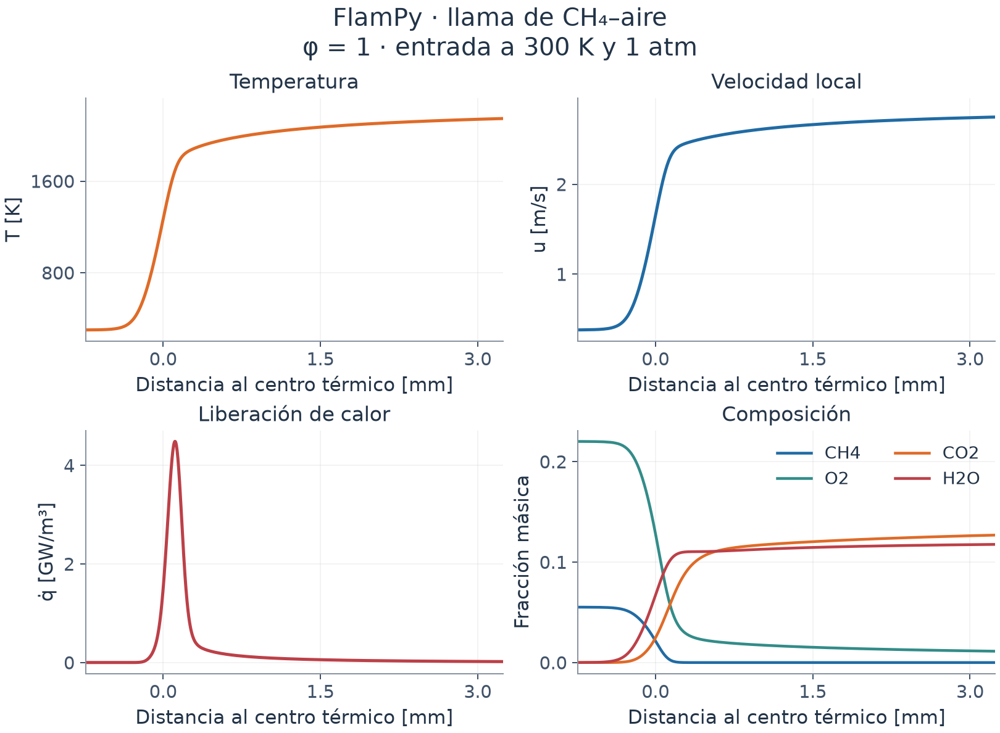
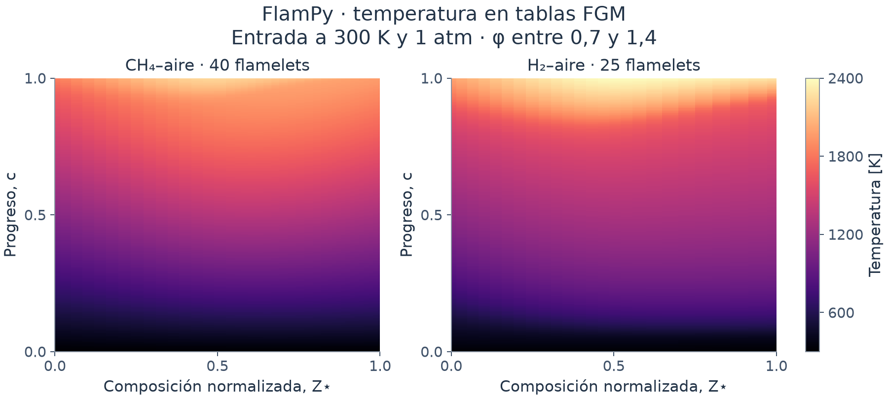

# FlamPy

**Llamas premezcladas con química detallada y tablas FGM, desde Python.**

FlamPy resuelve llamas laminares libres, planas, estacionarias y
unidimensionales. Calcula la velocidad de propagación y los perfiles
termoquímicos, adapta la malla y el dominio, y reúne familias de llamas en
tablas *Flamelet-Generated Manifold* (FGM).

El núcleo de resolución funciona en CPU con NumPy, SciPy y Numba.
Cantera es una dependencia opcional para comparaciones de referencia.

*CH₄–aire, φ = 1, entrada a 300 K y 101 325 Pa, transporte promediado por
mezcla sin Soret. Una ejecución aceptada con 261 nodos proporciona
Sᵤ ≈ 0,379 m/s. La posición se ha centrado en el punto medio del salto
térmico. [Datos y reproducción de las figuras](docs/results.md).*

## Qué puedes hacer

| Función | Resultado |
|---|---|
| Resolver una llama libre | Velocidad laminar, temperatura, velocidad local, composición, densidad y liberación de calor |
| Elegir la composición | Relación de equivalencia con combustible/oxidante, o cantidades molares `X` y másicas `Y` |
| Comparar transporte | Transporte promediado por mezcla o multicomponente; Soret disponible en ambos |
| Adaptar la resolución espacial | Refinamiento, eliminación de nodos y ampliación automática del dominio |
| Construir una familia FGM | Continuación entre composiciones y nuevos flamelets resueltos para refinar la interpolación |
| Guardar y consultar resultados | Arrays NumPy, CSV, metadatos, trazas de continuación y exportación de tablas `.fla` |
| Verificar la tabulación | Defecto por exclusión de filas y comparación con llamas retenidas independientes |

Se incluyen los mecanismos `gri30.yaml` (GRI-Mech 3.0, CH₄) y
`h2o2.yaml` (H₂/O₂ con N₂). Otros mecanismos requieren un YAML local
compatible con el lector nativo de gas ideal y termodinámica NASA-7.

## Instalación

Requiere **Python 3.11 o posterior**. Instala desde una copia del repositorio:

~~~sh
git clone https://github.com/kevinvidalalmeida-bit/FlamPy.git
cd FlamPy
python -m venv .venv
~~~

Activa el entorno:

~~~powershell
# Windows / PowerShell
.\.venv\Scripts\Activate.ps1
~~~

~~~sh
# Linux / macOS
source .venv/bin/activate
~~~

Después instala el paquete:

~~~sh
python -m pip install -e ".[plots]"
flampy --help
~~~

`python -m pip install -e .` instala solo el núcleo numérico.
`python -m pip install -e ".[reference]"` añade Cantera y las herramientas
de comparación, incluyendo las gráficas.

El nombre del proyecto y el comando principal son **FlamPy** y `flampy`.
El módulo Python conserva el nombre **`kflame`** por compatibilidad;
el comando `kflame` y `python -m kflame` también siguen disponibles.

## Primera llama en Python

~~~python
from kflame import solve_flame

flame = solve_flame(
    mechanism="gri30.yaml",
    fuel="CH4",
    oxidizer="O2:1, N2:3.76",
    phi=1.0,
    temperature=300.0,       # K
    pressure=101325.0,       # Pa
    transport="mixture-averaged",
    soret=False,
    plots=True,
)

print(f"Velocidad laminar: {flame['Su']:.4f} m/s")
print(f"Resultados: {flame['output']}")
z, temperature = flame["z"], flame["T"]
~~~

La salida incluye `flame.npz`, `profiles.csv` y `metadata.json`;
`plots=True` añade `profiles.png` y `profiles.pdf`. Todas las especies
del mecanismo se conservan en el NPZ. El parámetro `species` selecciona las
columnas de especies del CSV y sus curvas.

La primera ejecución puede tardar más por la compilación JIT de Numba.
Sin `output` se crea una carpeta nueva en `runs/flame/`. Si proporcionas
una ruta, debe ser una carpeta que todavía no exista.

## De una llama a una tabla FGM

*Familias aceptadas de CH₄–aire y H₂–aire entre φ = 0,7 y 1,4, a
300 K y 101 325 Pa, con transporte promediado por mezcla sin Soret.
Estas dos construcciones contienen 40 y 25 flamelets, respectivamente,
y 241 puntos de progreso. Z⋆ normaliza la coordenada de entrada solo
para dibujarla; la consulta utiliza Z.*

~~~python
from kflame import generate_fgm

folder = generate_fgm(
    mechanism="gri30.yaml",
    fuel="CH4",
    phis=(0.7, 0.9, 1.0, 1.1, 1.4),
    progress_species="CO2:1.0,H2O:1.0,CO:1.0,H2:0.5",
    progress_points=241,
    adaptive_phi=True,
    target_defect=0.01,
    plots=True,
    species=("CO2", "CO"),
    export=True,
)

print(folder / "fgm_table.npz")
~~~

`phis` define la familia **inicial**. Con `adaptive_phi=True`, FlamPy
resuelve llamas adicionales en intervalos cuyo defecto de interpolación
supera `target_defect`; el valor `0.01` representa un 1 %. La adaptación
del eje de progreso `c` reorganiza los perfiles ya calculados y se distingue
del refinamiento en composición.

Para H₂, configura también `mechanism="h2o2.yaml"`, `fuel="H2"`,
`progress_species="H2O:1.0,HO2:10.0"` y, si solicitas figuras,
`species=("H2", "O2")`. Los pesos de progreso son elecciones verificadas
para estas familias; deben revisarse al cambiar el dominio físico.

[API completa](docs/api.md) · [Lectura y consulta de archivos](docs/outputs.md)

## Ejemplos y comandos

~~~sh
python examples/example.py
python examples/example_fgm.py
python examples/query_fgm.py runs/fgm/MI_EJECUCION/fgm_table.npz
~~~

Los dos primeros ejemplos guardan matrices CSV y construyen sus figuras
explícitamente con Matplotlib. El tercero consulta una tabla ya generada.

| Comando | Uso |
|---|---|
| `flampy fgm` | Generar una familia y tabularla desde la línea de comandos |
| `flampy plot` | Dibujar los resultados de una ejecución FGM |
| `flampy export` | Exportar una tabla NPZ a `.fla` y CSV |
| `flampy refine-table` | Analizar una tabla y proponer composiciones adicionales |
| `flampy validate-table` | Comparar con llamas retenidas independientes |
| `flampy compare` | Comparar llamas individuales con Cantera |
| `flampy reference-fgm` | Construir una familia de referencia con Cantera |

Cada comando incluye `--help`. El refinamiento automático del defecto en
composición mostrado arriba pertenece a `generate_fgm`; `refine-table`
escribe un plan de nuevas llamas y no las resuelve por sí solo.

## Cómo funciona

~~~mermaid
flowchart LR
    A["Mecanismo y mezcla de entrada"] --> B["Estado inicial y malla"]
    B --> C["Newton y recuperación PTC / Euler implícito"]
    C --> D["Control de dominio, malla y aceptación"]
    D -->|Actualizar discretización| C
    D --> E["Llama aceptada"]
    E --> F["Familia y tabla FGM"]
~~~

La linealización usa un Jacobiano aproximado tridiagonal por bloques
con transporte congelado. La resolución combina LU, reutilización del
modelo lineal, Newton amortiguado y recuperación pseudotransitoria.
[Desarrollo de la arquitectura](docs/architecture.md).

## Alcance y documentación

El modelo actual es adiabático y de presión constante, con química
detallada en fase gaseosa. Las tablas ilustradas tienen dos coordenadas,
`(Z, c)`, a presión y temperatura de entrada fijas.

La convergencia y la concordancia con una implementación independiente
constituyen comprobaciones numéricas. La validación física requiere datos
experimentales; una aplicación CFD con pérdidas térmicas, estiramiento
o turbulencia exige ampliar los modelos y las coordenadas correspondientes.

| Guía | Contenido |
|---|---|
| [API Python](docs/api.md) | Funciones, parámetros, valores por defecto y errores |
| [Archivos y consulta](docs/outputs.md) | Formas de arrays, unidades y carga segura de NPZ |
| [Arquitectura](docs/architecture.md) | Química, transporte, resolución no lineal y FGM |
| [Resultados ilustrados](docs/results.md) | Condiciones, procedencia y reproducción de las imágenes |
| [Instalación y compatibilidad](docs/compatibility.md) | Dependencias y resolución de problemas frecuentes |
| [Ejemplos](examples/README.md) | Scripts editables para llamas, tablas y consulta |
| [Mecanismos y atribuciones](src/kflame/chemistry/data/README.md) | Origen de los datos químicos y del cierre Soret |

## Estructura del repositorio

~~~text
src/kflame/
    api.py              solve_flame y generate_fgm
    flame/              balances, malla, Jacobiano y resolución
    chemistry/          mecanismos, termoquímica, cinética y transporte
    fgm/                generación, adaptación, exportación y comprobación
    reference/          comparaciones opcionales con Cantera
examples/               scripts de uso y consulta
docs/                   documentación y galería reproducible
runs/                   nuevas ejecuciones locales, ignoradas por Git
~~~
