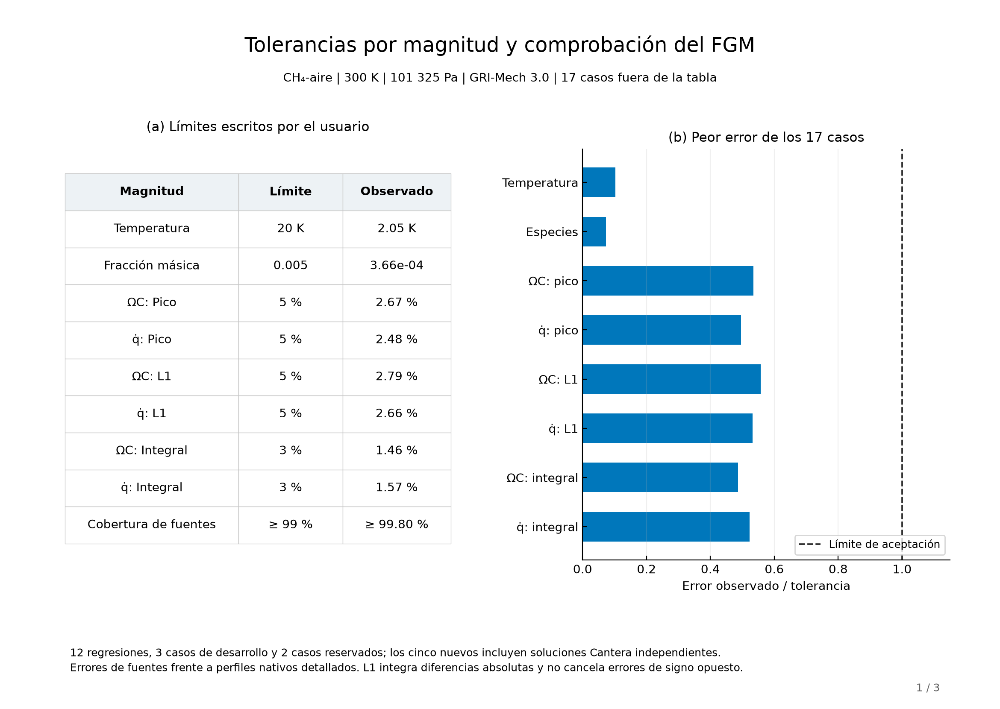
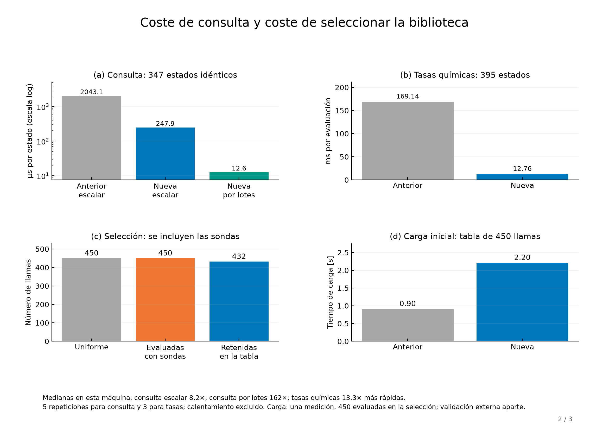
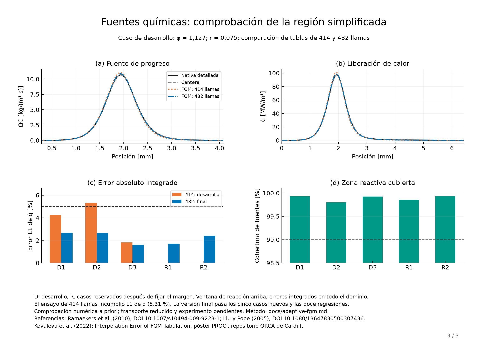

# Tolerancias y coste del FGM no adiabático

El usuario escribe los límites en [`examples/fgm_tolerances.json`](../examples/fgm_tolerances.json).
El controlador y el validador leen el mismo archivo. No existe un porcentaje
único de error ni un criterio fijado al combustible del ejemplo.

| Campo | Unidad o definición | Valor del ejemplo |
|---|---|---|
| `temperature_K` | Máxima diferencia absoluta de temperatura | 20 K |
| `species_absolute` | Máxima diferencia absoluta de cualquier fracción másica | 0,005 |
| `source_peak_relative` | Máxima diferencia dividida por el pico absoluto del perfil detallado | 0,05 por fuente |
| `source_L1_relative` | Integral de la diferencia absoluta / integral absoluta del perfil detallado | 0,05 por fuente |
| `source_integral_relative` | Diferencia de integrales / integral absoluta del perfil detallado | 0,03 por fuente |
| `source_coverage_min` | Fracción de la integral absoluta de la fuente cubierta por intervalos válidos | 0,99 por fuente |
| `node_coverage_min` | Fracción de nodos espaciales que pueden consultarse | 0,85 |

`0.01` significa 1 % en un campo relativo. Cada diccionario permite límites
distintos para `omega_C` y `qdot`; los campos omitidos conservan sus valores
por defecto. Estos valores son decisiones de precisión del ejemplo, no un
estándar universal. Las integrales usan la malla espacial no uniforme y no
unen intervalos separados por estados exteriores a la tabla. La norma L1
evita que errores positivos y negativos se oculten por cancelación.

Las tolerancias de interpolación son distintas de `rtol`/`atol` de Newton,
de los criterios de la malla espacial y del cierre del balance energético.
La aceptación física y numérica de las llamas se conserva al cambiar el
objetivo de tabulación. La inversión de `h(T,Y)` tiene su propio cierre
interno de 1e-6 J/kg.

## Refinamiento configurable

~~~python
from kflame import generate_adaptive_nonadiabatic_fgm
from kflame.fgm.accuracy import FGMTolerances

folder = generate_adaptive_nonadiabatic_fgm(
    phis=candidate_phis,                     # positivas, crecientes
    mass_flux_fractions=candidate_fractions,  # entre cero y uno
    mechanism=mechanism, fuel=fuel, oxidizer=oxidizer,
    progress_species=progress_weights,
    tolerances=FGMTolerances.from_file("examples/fgm_tolerances.json"),
    indicator_safety_factor=0.8,
    max_flames=450, max_iterations=40,
    progress_points=181,
    output="runs/adaptive",
)
~~~

Las listas contienen las coordenadas candidatas disponibles, no todas las
llamas que necesariamente se resolverán. El controlador empieza con pocas
composiciones y caudales, compara perfiles nativos interiores con la tabla
y añade las coordenadas del peor perfil que incumple un objetivo. Comprueba
también combinaciones de coordenadas nuevas para detectar errores acoplados.
Conserva una familia tensorial de celdas contiguas en `(Z,C,h)`.

`indicator_safety_factor=0.8` pide que los errores de las sondas sean como
máximo el 80 % de cada tolerancia. Los requisitos de cobertura mantienen
sus límites originales. Este margen configurable ayuda entre las sondas,
pero no constituye una cota matemática del error en todo el dominio.
Los perfiles adiabáticos definen la superficie de referencia; las sondas
de precisión se aplican a los perfiles de quemador.

`max_flames` cuenta todas las llamas distintas evaluadas, incluidas sondas
y referencias adiabáticas. `max_iterations` limita las rondas. Si se agota
un presupuesto o la resolución de candidatos sin sondas independientes,
se guarda el diagnóstico y se lanza `AdaptiveAccuracyError`. Ninguna
tolerancia se relaja para terminar. Una malla candidata demasiado gruesa
requiere ampliar las listas; aumentar `progress_points` mejora el muestreo
a lo largo de la trayectoria sin resolver nuevas llamas.

El controlador utiliza los mecanismos, corrientes, pesos de progreso,
presión, temperatura y transporte suministrados. H₂ necesita un mecanismo
y una combinación de especies de progreso apropiados; no se presupone
que la validación de CH₄ se transfiera a otro combustible.

~~~sh
python examples/adaptive_nonadiabatic_3d.py examples/adaptive_fgm_settings.json --tolerances examples/fgm_tolerances.json --output runs/adaptive
~~~

`--reuse-from` admite una biblioteca nativa aceptada con las mismas
condiciones y criterios del solver. No reduce el coste ya invertido en
crear esa biblioteca. Los perfiles guardados evitan repetir simulaciones
durante las rondas de refinamiento. El controlador conserva todos los bancos
de sondas anteriores: una biblioteca inicial parcial se complementa con los
perfiles nuevos. Cada reutilización vuelve a comprobar mecanismo, corrientes,
temperatura, presión, transporte y criterios del solver.

## Resultado de la evaluación

Para **este caso de CH₄–aire**, la selección conservadora mantiene
**432 llamas**: 24 composiciones,
17 caudales de quemador y una referencia adiabática por composición.
Para decidir esa selección evaluó **450 llamas** en 32 rondas. La tabla
se reduce un 4 %, pero este caso no demuestra ahorro de simulaciones;
con estos límites conviene conservar la biblioteca completa como referencia.

El recuento corresponde a GRI-Mech 3.0, 300 K, 101325 Pa, transporte
promediado sin Soret, candidatos de φ entre 0,7 y 1,3 y fracciones de caudal
entre 0,06 y 0,65, con las tolerancias publicadas. El controlador no contiene
un objetivo de 432 llamas: otras condiciones, candidatos o tolerancias pueden
producir otros recuentos o terminar sin certificar la precisión.

Una [comprobación retrospectiva adicional](assets/adaptive-generality/summary.json)
emplea perfiles de la misma biblioteca en dos subintervalos. En el intervalo
rico, unas tolerancias solicitadas menos exigentes producen 54 llamas
seleccionadas y 90 evaluadas; con las originales, los 126 candidatos se agotan
sin sondas independientes suficientes. En el intervalo pobre, ambas
configuraciones agotan los 90 candidatos sin certificar precisión. Estos
fallos se conservan y no relajan el criterio. Esta prueba comprueba la respuesta
del controlador; no valida nuevos combustibles ni garantiza ahorro de
simulaciones. Las 432 llamas y las 17 comprobaciones del caso principal se
conservan. Sus datos y huellas de código corresponden al commit `dd74eec`.

Un primer ensayo, sin margen, seleccionó 414 llamas y pasó los doce casos
anteriores. Un caso nuevo alcanzó 5,31 % de error L1 en `qdot`, superando
el 5 % solicitado. Se conserva ese resultado fallido en los datos. El
margen de 0,8 produjo la selección final; además de los casos de desarrollo,
se resolvieron dos casos reservados después de fijar el algoritmo.

Los **17 casos finales** pasan: doce regresiones anteriores, tres casos
de desarrollo y dos comprobaciones reservadas. Máximos observados:
2,67 % del pico para las fuentes, 2,79 % de error L1 y 1,57 % de error
de integral; cobertura de fuentes mínima de 99,80 % y error de temperatura
máximo de 2,05 K. Los cinco casos nuevos incluyen refinamiento espacial
nativo y soluciones independientes de `Cantera.BurnerFlame`.

Es una comprobación *a priori* de la tabla y del solver detallado.
La precisión de una futura integración de transporte reducido requiere
comprobaciones adicionales; aquí no se ha resuelto ese sistema ni se ha
hecho validación experimental.

## Optimización y medición

La búsqueda usa una jerarquía de cajas que examina todas las celdas
candidatas. Se conserva la interpolación baricéntrica, la recuperación de
temperatura desde la entalpía, el rechazo de estados exteriores y la
detección de solapamientos. `lookup_batch` permite consultar varios estados:

~~~python
from kflame.fgm.nonadiabatic3d import NonAdiabaticFGM

model = NonAdiabaticFGM(folder)  # carpeta devuelta por el generador
values = model.lookup_batch(Z=Z, C=C, h=h, outside="mask")
# Y: (estados, especies); covered: máscara. Estados exteriores: NaN.
~~~

La construcción de tetraedros se vectoriza. La continuación química para
concentraciones negativas pequeñas utiliza los participantes de cada reacción
y un bucle compilado; conserva las operaciones de tasas positivas y las
concentraciones firmadas de tercer cuerpo. No cambia la química ni recorta
las especies. Las tasas, los campos y las celdas de la biblioteca original
reconstruida coinciden bit a bit con la versión anterior. Las consultas
coinciden dentro del redondeo numérico, incluida la recuperación de `h`.

El [benchmark reproducible](../examples/benchmark_fgm_lookup.py) mide los
mismos 347 estados sobre la tabla de 450 llamas: cinco repeticiones para
consulta y tres para tasas químicas, excluyendo calentamiento y compilación.
La referencia es el commit `14af4ae`; se registran versiones, máquina,
configuración BLAS, tiempos individuales y diferencias numéricas. Los
factores de aceleración corresponden a esta máquina y estas entradas.
La carga inicial de la jerarquía tarda más; el beneficio aparece al reutilizar
el objeto para muchas consultas. Las mediciones de tasas no representan
el tiempo de resolución completa de una llama.

~~~sh
python examples/benchmark_fgm_lookup.py --output runs/fgm_benchmark.json
python examples/reconstruct_adaptive_table.py --output runs/adaptive_selected
python examples/plot_adaptive_fgm.py --output output/figures/adaptive
~~~

La reconstrucción reutiliza los vértices nativos de la biblioteca publicada,
reconstruye su conectividad y reproduce exactamente la tabla final. La
selección y los datos de las figuras se publican sin duplicar otra tabla
de unos 40 MB. Para generar la familia desde cero, usa el ejemplo adaptativo
y luego valida perfiles exteriores a sus composiciones y caudales con
`validate_nonadiabatic_3d.py --tolerances examples/fgm_tolerances.json`.

## Referencias que orientan las decisiones

- [Ramaekers, van Oijen y de Goey (2010), *A Priori Testing of Flamelet Generated Manifolds*](https://link.springer.com/article/10.1007/s10494-009-9223-1): comparación de manifolds con estados detallados para evaluar sus predicciones. Aquí se utiliza esa separación entre comprobación de tabulación y aplicación al flujo.
- [Kovaleva, Rieth y Chen (2022), *Interpolation Error of FGM Tabulation in an Unnormalised Progress Variable Subspace*](https://orca.cardiff.ac.uk/id/eprint/151580/1/PROCI_22_poster.pdf), póster científico: analiza errores ligados al progreso común y a los límites variables de las trayectorias. Motiva comprobar cobertura y perfiles interiores, además del espaciado.
- [Liu y Pope (2005), *The performance of in situ adaptive tabulation in computations of turbulent flames*](https://www.tandfonline.com/doi/abs/10.1080/13647830500307436): distingue errores locales y globales en ISAT. La implementación presente es una selección offline de flamelets; la validación independiente comprueba sus indicadores locales.

Los límites 20 K, 5 % y 3 %, el margen 0,8 y la búsqueda por cajas son
decisiones explícitas de esta implementación, no prescripciones de esos trabajos.
