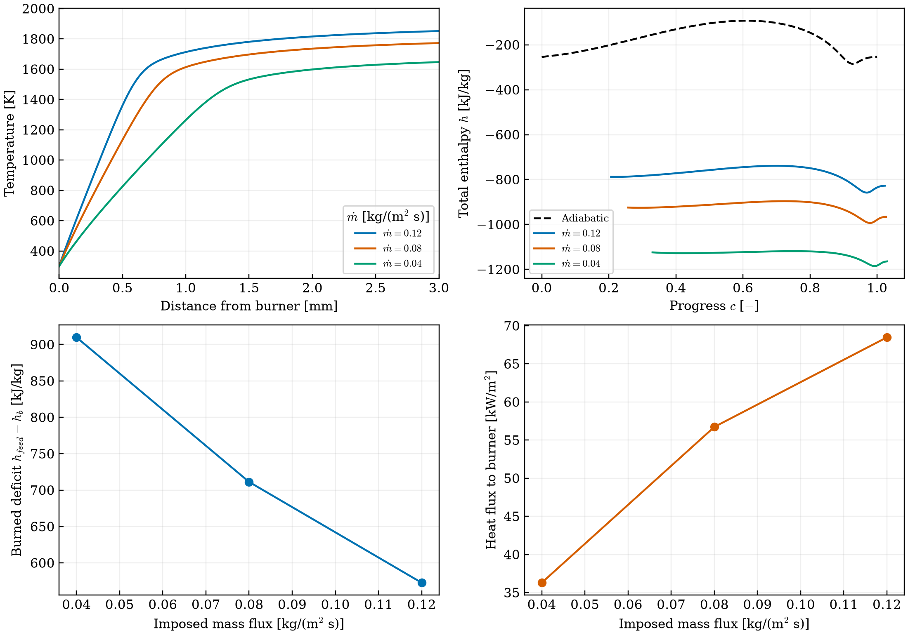

# Pérdidas de calor hacia un quemador

[Inicio](../README.md) · [API](api.md) · [Ejemplo](../examples/example_heat_loss.py)

Esta implementación resuelve una llama premezclada estacionaria y plana sobre
un quemador isotérmico. Se imponen su temperatura y el flujo másico de entrada;
la conducción del gas hacia la superficie determina la pérdida de calor.
El núcleo conserva las ecuaciones de energía, especies y transporte de FlamPy.

## Fundamento y alcance

[Gövert et al. (2015)](https://doi.org/10.1016/j.apenergy.2015.06.031), sección 2.1.3,
generan estados no adiabáticos mediante llamas estabilizadas en quemador y
reducen el caudal para aumentar la pérdida de entalpía por unidad de masa.
Su FGM incorpora la entalpía como segundo control junto al progreso de reacción.
La introducción de esta dimensión en sistemas con pérdidas ya aparece en
[van Oijen, Lammers y de Goey (2001)](https://doi.org/10.1016/S0010-2180(01)00316-9).

FlamPy añade un FGM de **composición de alimentación fija**, con controles
`(c,h)`. Variar independientemente la composición requerirá construir y validar
un tercer control `Z`. El modelo actual incluye la conducción hacia la cara del
quemador; no resuelve la conducción en el sólido, radiación ni el apagado
multidimensional junto a una pared lateral. Para ese último problema,
[Steinhausen et al.](https://doi.org/10.1007/s10494-020-00146-w) muestran limitaciones
de las tablas construidas únicamente con llamas premezcladas estacionarias.

## Condiciones y entalpía

Con `z` dirigido desde el quemador hacia los gases, las condiciones de entrada son

\[
T(0)=T_b,\qquad \rho(0)u(0)=\dot m,
\qquad J_k(0)+\dot m Y_k(0)=\dot m Y_{k,\mathrm{feed}}.
\]

`temperature` fija tanto la temperatura de la superficie como la de la mezcla
alimentada. La composición del gas junto a la superficie puede diferir de la
alimentación por difusión. En la salida se anulan los gradientes de temperatura
y especies. El flujo másico impuesto sustituye el anclaje de temperatura de la
llama libre; `inlet_velocity` es una velocidad de alimentación, no `Su`.

La entalpía específica es **total**, con las contribuciones sensibles y de formación
del mecanismo químico:

\[
h(T,Y)=\sum_k Y_k\frac{\bar h_k(T)}{W_k}\quad[\mathrm{J/kg}].
\]

Se conservan las referencias NASA del mecanismo, por lo que `h` puede ser
negativa. Para el FGM se define el déficit respecto a la trayectoria adiabática
al mismo progreso,

\[
\Delta h(c)=h_{\mathrm{ad}}(c)-h.
\]

La tabla y su consulta emplean **`h` dimensional**. `delta_h` es un diagnóstico;
no se altera la generación química de calor con un factor artificial. El control
de progreso utiliza una única normalización adiabática para toda la familia:

\[
c=\frac{\sum_k a_kY_k-\beta_u}{\beta_{b,\mathrm{ad}}-\beta_u}.
\]

El enfriamiento cambia la composición de equilibrio, por lo que ciertos estados
pueden alcanzar `c>1`. Se conservan; si no existe una referencia adiabática a ese
progreso, `delta_h` se guarda como `NaN` y la consulta devuelve `None`.
No se normaliza cada llama por separado ni se fuerza su extremo a uno.

La estimación del calor conducido hacia la superficie y su comprobación global son

\[
q_b\simeq\lambda_{1/2}\frac{T_1-T_0}{z_1-z_0},\qquad
q_b\simeq\dot m\,[h_{\mathrm{feed}}-h_{\mathrm{out}}].
\]

La segunda relación exige una salida sin flujos difusivos o conductivos; se
guardan ambos diagnósticos. Su diferencia mide el cierre energético en la malla
finita. El campo local `h_feed-h` no equivale automáticamente a una pérdida local
hacia la pared: la difusión preferencial también redistribuye entalpía,
especialmente en H₂. Esa distinción aparece en la formulación no adiabática con
difusión preferencial de [Kinuta et al. (2024)](https://arxiv.org/abs/2406.09727).

## Uso

~~~python
from kflame import solve_burner_flame, generate_burner_fgm

flame = solve_burner_flame(
    phi=1.0, temperature=300.0, pressure=101325.0,
    mass_flux=0.08, initial_points=24,
)
print(flame["inlet_velocity"])
print(flame["heat_loss"])

folder = generate_burner_fgm(
    phi=1.0, mass_fluxes=(0.12, 0.08, 0.04),
    initial_points=24,
)
~~~

Los caudales se expresan en kg/(m² s); las demás opciones de llama coinciden con
[`solve_flame`](api.md). `mass_flux` debe ser positivo y finito.
`generate_burner_fgm` requiere que todas las llamas superen la aceptación
numérica, el refinamiento y la comprobación de rama reactiva. Por defecto exige
un error de cierre energético menor que `max_energy_error=0.02`.
Una solución fría también puede satisfacer las ecuaciones: se rechaza como
llama si el salto térmico no supera 50 K o el máximo de liberación de calor no
supera 1 W/m³. Estos umbrales son diagnósticos de rama, no criterios físicos de
extinción.

~~~python
from kflame.fgm.nonadiabatic import BurnerFGM

fgm = BurnerFGM(folder)
state = fgm.lookup(c=0.5, h=-700000.0)  # J/kg; dentro de esta familia CH4-aire
print(state["T"], state["Y"], state["delta_h"])
~~~

La consulta interpola solamente entre llamas adyacentes con ambos extremos de
progreso resueltos. Recupera `T` de la entalpía solicitada y las especies
interpoladas usando la termodinámica NASA. Fuera de esa región produce
`ValueError`; no rellena huecos ni prolonga artificialmente estados enfriados.
Los pesos de progreso deben ser adecuados y monótonos para cada combustible.
Si las trayectorias se cruzan en `(c,h)`, la construcción falla e indica que se
debe revisar la familia o los controles.

## Salidas y reproducción

Cada llama guarda `flame.npz`, `profiles.csv` y `metadata.json`. Los casos de
quemador añaden `h_mass`, `enthalpy_departure_from_feed` y flujos conductivos,
difusivos y totales de entalpía en las caras, con `z_face` de longitud `N-1`.
El CSV incluye la entalpía total en J/kg; los metadatos identifican el caudal y
las unidades de cada diagnóstico de calor. La tabla `burner_fgm.npz` almacena
los controles, propiedades, especies, fuente de progreso `omega_c` en s⁻¹ y
una máscara `valid`. Las entradas no alcanzables contienen `NaN`.

~~~sh
python -m pip install -e ".[plots,reference,test]"
python -m pytest tests -q
python examples/example_heat_loss.py --output runs/burner_example
python examples/validate_burner.py runs/burner_example --h2 --withheld-mass-flux 0.10 --mesh-check
~~~

El [ejemplo](../examples/example_heat_loss.py) calcula CH₄–aire a φ=1,
300 K y 101325 Pa, con 0.04, 0.08 y 0.12 kg/(m² s), y dibuja cuatro paneles:
temperatura, trayectorias `(c,h)`, déficit específico y flujo de calor hacia el
quemador. Estos dos últimos no son intercambiables: al reducir el caudal puede
aumentar la pérdida por kilogramo y disminuir el calor transferido por unidad
de superficie.

La comprobación independiente utiliza
[`Cantera.BurnerFlame`](https://www.cantera.org/3.2/examples/python/onedim/burner_flame.html)
con el mismo mecanismo, alimentación y transporte. El núcleo de FlamPy no
importa Cantera ni utiliza sus soluciones como semillas. Los errores de la
familia de ejemplo y de una llama retenida a 0.10 kg/(m² s) se publican en
[`burner_validation.json`](assets/burner_validation.json). Esa comparación es
numérica; no constituye validación experimental ni garantiza esos errores para
otros combustibles, caudales o pesos de progreso.

En esta ejecución pasan 21 pruebas y cinco comparaciones independientes:

| Mezcla | Flujo másico [kg/(m² s)] | Máximo error de temperatura [K] | Error de cierre energético [%] |
|---|---:|---:|---:|
| CH₄–aire, φ=1 | 0.04 | 2.00 | 0.296 |
| CH₄–aire, φ=1 | 0.08 | 0.98 | 0.308 |
| CH₄–aire, φ=1 | 0.12 | 0.70 | 0.366 |
| CH₄–aire, φ=1, retenida | 0.10 | 1.17 | 0.304 |
| H₂–aire, φ=0.7, multicomponente y Soret | 0.08 | 0.17 | 0.312 |

La consulta FGM cubre 213 de los 225 nodos de la llama retenida (94.7 %), con
un máximo error de temperatura de 0.35 K y de fracción másica de 0.000172.
El error máximo de liberación de calor, dividido por el pico de la llama
retenida, es 4.44 %. Los 12 nodos restantes se identifican como no cubiertos.
Al pasar de 221 a 416 nodos para el caso de 0.08 kg/(m² s), el error de cierre
energético disminuye de 0.308 % a 0.139 %, y el flujo de calor cambia un 0.095 %.
