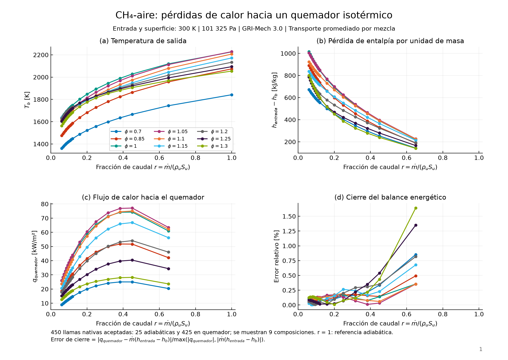
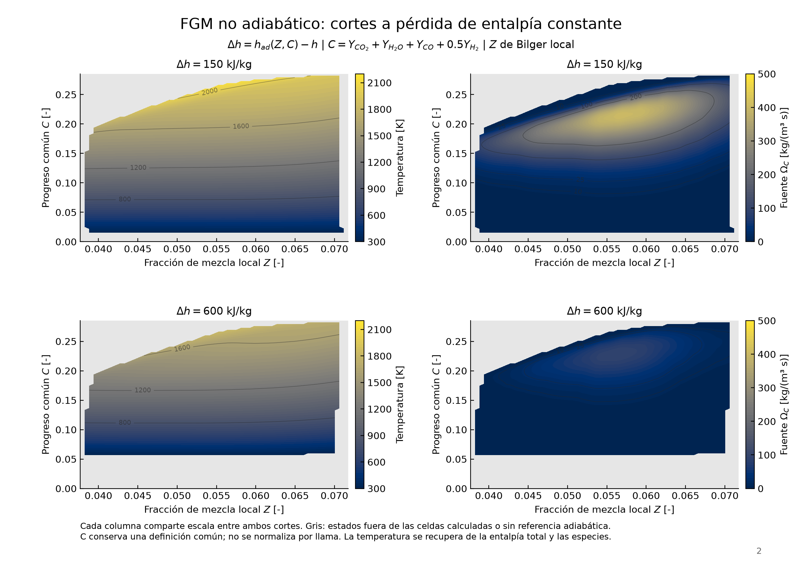
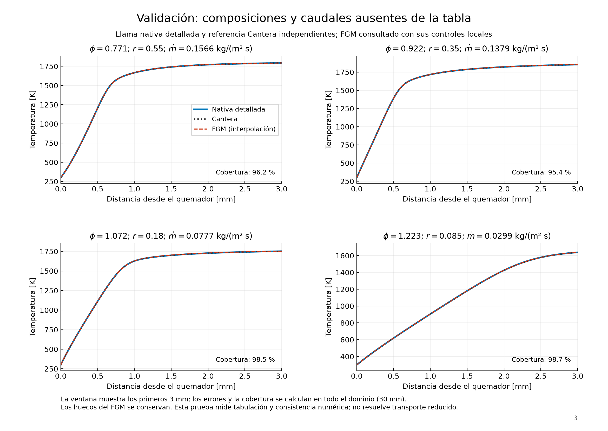
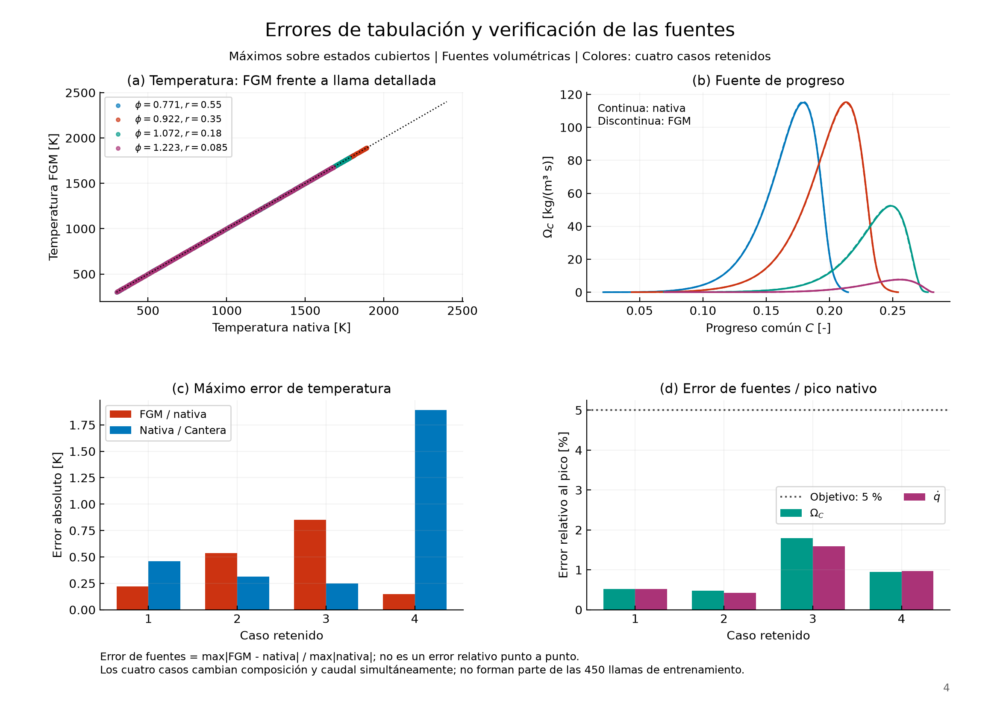
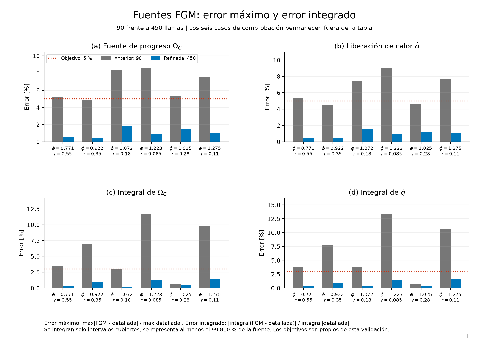
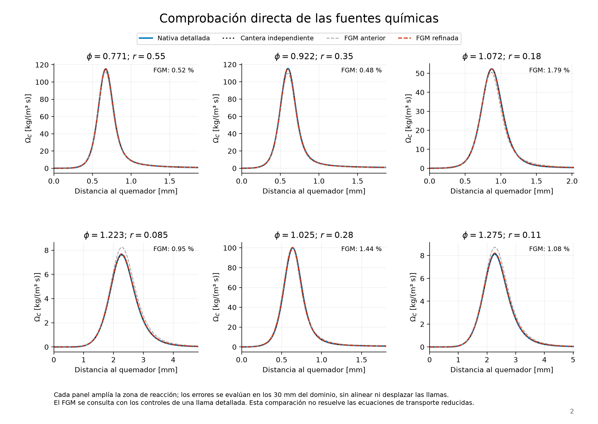
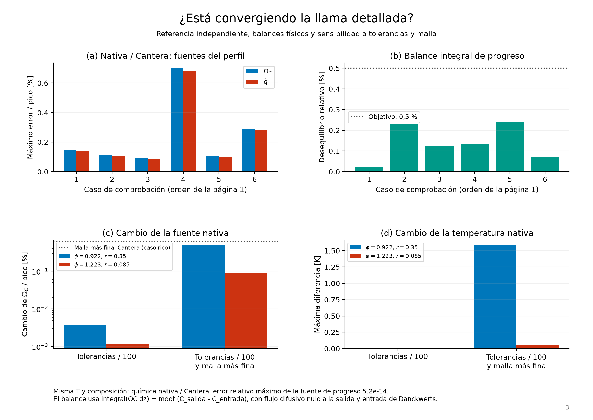
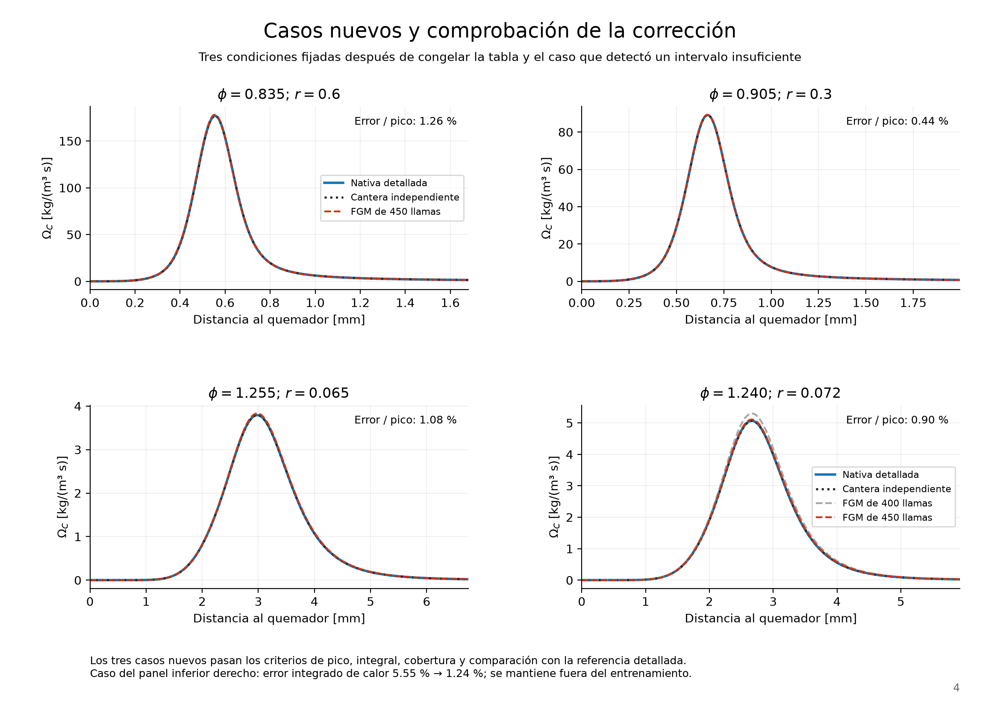

# FGM con pérdidas de calor: composición, progreso y entalpía

[Inicio](../README.md) · [Modelo de quemador](heat-loss.md) · [API](api.md)

Esta rama incorpora una biblioteca nativa de llamas planas estabilizadas sobre
un quemador isotérmico. La tabla se consulta mediante `(Z,C,h)`; modificar la
entalpía cambia también la composición y la fuente química. Las pérdidas se
obtienen resolviendo las llamas con conducción hacia la superficie.

## Fundamento y decisiones

La generación de niveles de entalpía mediante llamas de quemador con distintos
caudales sigue la estrategia de [Gövert et al. (2015)](https://doi.org/10.1016/j.apenergy.2015.06.031)
y [Gövert et al. (2018), sección 2.3.3](https://link.springer.com/article/10.1007/s10494-017-9848-4).
La reducción del caudal aumenta la pérdida de entalpía por kg, aunque el flujo
absoluto de calor hacia el quemador puede disminuir.

Los controles y las unidades son:

| Campo | Definición | Unidad |
|---|---|---|
| `Z` | Bilger local, calculado desde las fracciones másicas de especies; combustible y oxidante definidos en base molar | 1 |
| `C` | `Y_CO2 + Y_H2O + Y_CO + 0.5 Y_H2` para el ejemplo de CH₄ | 1 |
| `h` | Entalpía específica total, sensible más formación, con la referencia del mecanismo | J/kg |
| `delta_h` | `h_ad(Z,C) - h`, donde existe la superficie adiabática de referencia | J/kg |
| `omega_C` | Fuente volumétrica `sum(a_k W_k omega_k_molar)` | kg/(m³ s) |
| `qdot` | Liberación volumétrica de calor | W/m³ |

`C` tiene los mismos pesos en todas las llamas y no se estira para forzar que
cada extremo quemado valga uno. Se comprueba su monotonía en cada perfil;
otros combustibles pueden necesitar pesos distintos. El progreso sin escalar
evita los términos adicionales asociados a una normalización dependiente de
la composición, como explica [Gövert et al., sección 2.1.2](https://link.springer.com/article/10.1007/s10494-017-9848-4).

`Z` conserva su definición de Bilger: cero en el oxidante y uno en el
combustible. No se normaliza al intervalo de la figura ni se sustituye por
`Z_in`. El transporte de especies puede hacer que varíe dentro de una llama.
[Kinuta et al. (2024)](https://arxiv.org/html/2406.09727v1) emplean controles
`(C,Z,delta_h)` y muestran la importancia de la difusión preferencial para H₂.
Su modelo incluye estiramiento y cierres de transporte que esta biblioteca
plana todavía no incorpora.

La entalpía total tiene balance conservativo sin fuente química independiente:
la energía de formación ya forma parte de `h`. Para acoplar un futuro solver
reducido habrá que transportar `Z`, `C` y `h`, conservando los flujos de difusión
de especies y entalpía; disponer de una tabla no sustituye esas ecuaciones.

## Generación e interpolación

El ejemplo publicado utiliza GRI-Mech 3.0, CH₄-aire, 300 K, 101325 Pa,
transporte promediado por mezcla sin Soret y un dominio de 30 mm:

- 25 composiciones: se dividen en tres los intervalos de la familia base
  `phi = [0.7, 0.85, 1, 1.05, 1.1, 1.15, 1.2, 1.25, 1.3]`.
- 17 fracciones de caudal: se conservan
  `r = [0.65, 0.45, 0.25, 0.20, 0.16, 0.12, 0.10, 0.08, 0.06]`
  y se dividen en tres los intervalos `[0.25,0.45]`, `[0.08,0.10]`,
  `[0.10,0.12]` y `[0.06,0.08]`.
  `mdot = r rho_u Su`, con `Su` resuelta para la referencia adiabática de cada mezcla.
- 450 llamas aceptadas: 25 adiabáticas y 425 en quemador; 181 muestras por trayectoria.
- 81450 vértices y 440640 tetraedros; ninguna celda invertida o degenerada.

La malla física de cada llama es no uniforme y adaptativa. La continuación
entre caudales proporciona una estimación inicial nativa; cada llama se vuelve
a resolver, refinar y comprobar. Un fallo numérico se registra como tal y no
se interpreta como extinción física.

El parámetro interno `s` distribuye las muestras sobre cada trayectoria. No es
el control físico `C`. Se conservan los extremos de cada llama, incluidos los
productos de enfriamiento que pueden superar el progreso final adiabático.

La malla de consulta conecta únicamente composiciones, caudales y muestras
contiguos. No rellena un casco convexo ni extrapola en los huecos. Las celdas
invertidas se excluyen y se cuentan; las consultas en interiores superpuestos
producen `AmbiguousManifoldError`. Un estado exterior produce
`OutsideManifoldError`.

Las especies y fuentes se interpolan con coordenadas baricéntricas. La
temperatura se recupera resolviendo `h(T,Y)=h_consulta` con los polinomios NASA;
no se interpola de forma independiente de la entalpía. Esta construcción
conserva `sum(Y)`, `Z` y `C` dentro de la precisión numérica. La producción
y la consulta utilizan química y termodinámica nativas; Cantera se importa
solo en las comparaciones de referencia.

~~~python
from kflame.fgm.nonadiabatic3d import NonAdiabaticFGM

fgm = NonAdiabaticFGM("docs/assets/nonadiabatic3d")
# Controles de un estado calculado; reemplázalos por los de tu caso.
Z, C, h = fgm.table["controls"][8000]
state = fgm.lookup(Z=float(Z), C=float(C), h=float(h))
print(state["T"], state["omega_C"])
~~~

## Validación numérica

Se distinguen tres comprobaciones: la evaluación de la química a temperatura
y composición conocidas, la convergencia de la llama detallada y la
interpolación de la tabla. Una temperatura próxima a la referencia no basta
para demostrar que sus fuentes químicas sean precisas.

La evaluación nativa de las fuentes de progreso y calor coincide con Cantera
a la misma `T`, `Y` y presión: el máximo error relativo al pico es
5.2e-14.
La comparación entre **llamas resueltas por separado**, con el mismo mecanismo,
condiciones y transporte, tiene un error máximo de fuentes del
0.701 %.
También se verifican la suma de las fuentes de masa, la fuente química de `Z`
y la conservación de los tres controles al consultar la tabla.

Las llamas retenidas y sus referencias independientes usan una malla más fina
que las de generación: pendiente 0.02 y curvatura 0.04. El FGM se consulta con
los controles locales de estas llamas detalladas, por lo que esta prueba mide
**precisión de tabulación a priori**.

Para una fuente `f`, se registran tres errores:

- Máximo respecto al pico: `E_inf = max|f_FGM - f_det| / max|f_det|`.
- Error absoluto integrado: `E_L1 = integral|f_FGM - f_det| / integral|f_det|`.
- Error de la integral neta: `E_int = |integral(f_FGM - f_det)| / integral|f_det|`.

El primero no es un error relativo punto a punto ni un residuo del solver.
El segundo evita que los errores positivos y negativos se cancelen. Se
integran solo intervalos cuyos dos extremos están cubiertos, sin unir huecos;
el denominador usa toda la fuente detallada. Se informa además la fracción
de `integral|f_det|` representada por esos intervalos.

Los objetivos de esta validación son `E_inf < 5 %`, `E_L1 < 5 %`,
`E_int < 3 %` y cobertura de la fuente superior al 99 %, para ambas fuentes.
Son criterios propios de esta comprobación, no un estándar universal de FGM.
Se mantienen los límites de temperatura ≤20 K y especies ≤0.005; para la
comparación nativa/Cantera se exigen temperatura ≤5 K, especies ≤0.002,
fuentes ≤2 % del pico, error de pérdida de entalpía ≤1 % y cierre energético ≤2 %.

La tabla anterior de 90 llamas tenía un máximo de fuentes del 8.99 % del pico,
pero un error de la integral del calor del **13.26 %**. Su criterio anterior
del 15 % sobre el pico omitía esa diferencia acumulada. Duplicar las muestras
de progreso a 361 apenas la redujo; se refinaron las composiciones y los
caudales. Una primera confirmación de la tabla de 400 llamas detectó un error
integrado de calor del 5.55 % en `phi=1.24, r=0.072`. Se conserva
[ese resultado fallido](assets/nonadiabatic3d/source_accuracy/development_confirmation400.json)
y se añadió resolución en `[0.06,0.08]`, manteniendo ese caso fuera de la tabla.
La familia final de 450 llamas vuelve a usar 181 muestras de progreso y pasa
los mismos límites.

Los nueve casos de desarrollo permanecen ausentes del entrenamiento:

| φ | r | Error T [K] | Error Ω_C / pico [%] | Error q̇ / pico [%] | Máx. error integrado [%] |
|---:|---:|---:|---:|---:|---:|
| 0.771362 | 0.55 | 0.220 | 0.52 | 0.52 | 0.36 |
| 0.921954 | 0.35 | 0.535 | 0.48 | 0.42 | 0.99 |
| 1.072381 | 0.18 | 0.852 | 1.79 | 1.59 | 0.30 |
| 1.222702 | 0.085 | 0.148 | 0.95 | 0.97 | 1.42 |
| 1.025000 | 0.28 | 0.794 | 1.44 | 1.23 | 0.44 |
| 1.275000 | 0.11 | 0.140 | 1.08 | 1.07 | 1.57 |
| 0.825000 | 0.52 | 0.240 | 0.93 | 0.91 | 0.41 |
| 1.095000 | 0.175 | 0.879 | 1.62 | 1.45 | 0.27 |
| 1.240000 | 0.072 | 0.158 | 0.90 | 0.89 | 1.24 |

Después de congelar la familia se fijaron y resolvieron **tres casos nuevos**,
que no intervinieron en su refinamiento. Su
[plan de comprobación](assets/nonadiabatic3d/source_accuracy/confirmatory_plan.json)
identifica la tabla y las condiciones antes de evaluarlos:

| φ | r | Error T [K] | Error Ω_C / pico [%] | Error q̇ / pico [%] | Máx. error integrado [%] |
|---:|---:|---:|---:|---:|---:|
| 0.835000 | 0.6 | 0.468 | 1.26 | 1.22 | 0.23 |
| 0.905000 | 0.3 | 0.335 | 0.44 | 0.43 | 0.22 |
| 1.255000 | 0.065 | 0.149 | 1.08 | 1.07 | 1.36 |

En los doce casos, el máximo error de fuentes respecto al pico es
1.79 %, el error absoluto
integrado es 2.23 % y el error de
la integral neta es 1.57 %.
La cobertura mínima del peso de la fuente es
99.81 % y el error máximo de
temperatura FGM/detallada es 0.879 K.
El cierre energético máximo del entrenamiento es 1.639 %.

El balance de progreso comprueba
`integral(omega_C dz) = mdot (C_salida - C_entrada)`:
la condición de Danckwerts impone el flujo total de entrada y el gradiente
de especies es nulo a la salida. Su desequilibrio máximo es
0.240 % en las doce llamas
retenidas y 0.486 % en las 425 llamas de quemador
del entrenamiento, usando sus mallas espaciales originales.

Se redujeron cien veces las tolerancias de Newton en dos casos y después
se refinaron sus mallas. El cambio máximo de la fuente de progreso fue
0.00375 % al modificar solo las tolerancias y 0.501 % al añadir refinamiento
espacial. La referencia Cantera del caso rico también se refinó desde su
propia solución: su fuente cambió un 0.609 % del pico. Estas comprobaciones
separan el error de discretización del error de tabulación.
El residuo absoluto `Finf` mezcla ecuaciones con escalas distintas; se
conserva en los informes junto con la norma ponderada del paso de Newton,
los balances y los cambios de malla. Véanse los
[criterios de convergencia de Cantera](https://www.cantera.org/3.2/reference/onedim/nonlinear-solver.html)
y su [análisis de refinamiento](https://www.cantera.org/3.2/examples/python/onedim/flame_speed_convergence_analysis.html).

La fuente usada por el FGM es la **fuente tabulada e interpolada**.
Reevaluar la química detallada con `T,Y` interpolados es un diagnóstico
distinto: las tasas son no lineales y sensibles a especies minoritarias, y
esa reevaluación no asegura menor error. Sus métricas también se conservan
en `source_audit.json`; no se utiliza en la consulta de producción.

La cobertura de nodos espaciales y la cobertura de la fuente son magnitudes
distintas. Los nodos exteriores se registran como no cubiertos, conservando
los huecos en las figuras. Los informes y perfiles publicados incluyen
huellas SHA-256 del mecanismo, código, tabla y datos utilizados.

## Figuras y reproducción

Los mapas usan `Z` horizontal y `C` vertical, Cividis e isolíneas. Cada campo
comparte escala en ambos niveles de pérdida de entalpía; gris significa un
estado no resuelto. Las curvas utilizan colores diferenciados y tipos de línea.

Para reproducir las figuras a partir de los arrays publicados:

~~~sh
python examples/plot_nonadiabatic_3d.py docs/assets/nonadiabatic3d --output output/figures/nonadiabatic3d
python examples/plot_source_audit.py --output output/figures/source_accuracy --pdf output/pdf/Revision_fuentes_FGM.pdf
python examples/audit_nonadiabatic_sources.py --output runs/source_audit
~~~

Para regenerar las llamas y las comparaciones:

~~~sh
python examples/example_nonadiabatic_3d.py --output runs/nonadiabatic
python examples/validate_nonadiabatic_3d.py runs/nonadiabatic --output runs/validation3d --fine-native --mesh-check
python examples/validate_nonadiabatic_3d.py runs/nonadiabatic --output runs/validation3d_extra --phis 1.025 1.275 --fractions 0.28 0.11 --fine-native
python examples/validate_nonadiabatic_3d.py runs/nonadiabatic --output runs/validation3d_development --phis 0.825 1.095 1.24 --fractions 0.52 0.175 0.072 --fine-native
python examples/validate_nonadiabatic_3d.py runs/nonadiabatic --output runs/validation3d_confirmatory --phis 0.835 0.905 1.255 --fractions 0.60 0.30 0.065 --fine-native
python examples/check_training_balance.py runs/nonadiabatic --output runs/training_progress_balance.json
python examples/check_burner_accuracy.py runs/validation3d/case_03_native_fine --output runs/convergence_rich --reference runs/validation3d/case_03_reference_fine.npz
python examples/check_burner_accuracy.py runs/validation3d/case_01_native_fine --output runs/convergence_lean
python examples/plot_nonadiabatic_3d.py runs/nonadiabatic --validation runs/validation3d --output output/figures/nonadiabatic3d
~~~

`example_nonadiabatic_3d.py` genera por defecto la familia final de 450 llamas.
Para refinar una biblioteca previa se puede usar
`refine_nonadiabatic_sources.py`, con subdivisiones de composición y los
intervalos de caudal que requieren más resolución. La función de la API
permite elegir explícitamente ambas listas y el número de muestras.

El paquete de datos permite consultar la tabla y redibujar las figuras; la
regeneración resuelve todas las llamas y guarda las trazas completas en `runs/`.
`--reuse-from` permite aprovechar otra biblioteca aceptada con condiciones y
refinamiento coincidentes. `--build-only` reconstruye la tabla desde perfiles
aceptados, y `--recheck` recalcula las métricas sin volver a resolverlos.

## Alcance

La ampliación con [tolerancias por magnitud y refinamiento adaptativo](adaptive-fgm.md)
conserva esta biblioteca de referencia. Documenta la selección de 432 llamas,
sus comprobaciones independientes y la aceleración de consultas por lotes.

Se ha validado numéricamente una biblioteca de CH₄ con pérdidas hacia un
quemador plano a 300 K. El [estudio de transporte reducido](reduced-burner.md)
añade los balances de Z, C y h y sus comparaciones a posteriori: 17 de 17 casos
cumplen todos los límites con el cierre revisado y una nueva definición de C.
La auditoría global todavía encuentra regiones no admisibles: el solver las
rechaza y no se certifica todo el espacio de la tabla.
Tampoco se han validado experimentalmente extinción, apagado
transitorio, radiación, conducción dentro del sólido, una geometría de pared
multidimensional o un FGM no adiabático de H₂. El caso nativo de H₂ con Soret
de la primera fase está documentado en [el modelo de quemador](heat-loss.md).
