# Transporte FGM con pérdidas hacia un quemador

Esta versión de `feature/nonadiabatic-enthalpy` mejora la estabilidad y el
rendimiento del solver, pero **sigue siendo experimental para pérdidas pequeñas**.
Las **44 condiciones convergen numéricamente; 35 cumplen todas las tolerancias
físicas**. Pasan las 33 condiciones ensayadas con `r ≤ 0.65`; nueve condiciones
con pérdidas pequeñas exceden el límite de calor y una de ellas también los de
temperatura y fuentes. No se han relajado los límites ni eliminado los fallos.
La tesis conserva su alcance adiabático.

Se mantienen **432 llamas físicas de entrenamiento**, 181 estados de llama y
16 de continuación química por fila: 85 104 vértices y 459 816 tetraedros, sin
plegamientos ni degeneraciones. La selección se ha redistribuido tras los
fallos de desarrollo: 264 filas son idénticas a la biblioteca publicada de 450
llamas y 168 son nuevas. El presupuesto corresponde a estas condiciones de
CH₄-aire; no es una constante universal ni un criterio automático de precisión.

## Física y relación con los artículos

Los controles son Z local de Bilger, progreso C sin normalizar y entalpía total
h, con energía sensible y de formación. Se resuelven llamas estacionarias de
quemador plano a 300 K y 101 325 Pa, transporte promediado por mezcla y sin
Soret. El flujo superficial impuesto es ṁ = ρu. Con J como flujo de especies:

\[
F_Z=\dot m Z+w_Z\cdot J,\quad
F_C=\dot m C+w_C\cdot J,\quad
F_h=\dot m h-\lambda T'+\sum_k h_kJ_k.
\]

El cierre conservativo satisface `F′Z = 0`, `F′C = ΩC` y `F′h = 0`.
**No se añade liberación química de calor a la ecuación de h**: eso duplicaría
la energía química. Las fuentes de todas las especies, ΩC y q̇ se calculan fuera
del solver y se almacenan en la tabla. El transporte reducido no evalúa cinética.

En el quemador se fijan T y los flujos alimentados de Z y C; el flujo de h
incluye el calor conductivo hacia la superficie. La salida tiene gradientes
nulos. `q = λ(T₁−T₀)/(x₁−x₀)` es positivo hacia el quemador y depende de la
resolución de la primera celda; `ṁ(hentrada−hsalida)` comprueba el balance.
El balance discreto por sí solo no verifica la precisión física.

[Gövert et al. (2018), sección 2.3.3](https://link.springer.com/article/10.1007/s10494-017-9848-4)
construyen flamelets de quemador variando el caudal e incorporan entalpía como
control, con mapas de fuente y perfiles de T, CO y OH. Sus condiciones y su
cierre Le = 1 difieren del transporte preferencial utilizado aquí.

[Gupta, Teerling y van Oijen (2021)](https://doi.org/10.1080/13647830.2021.1926544)
proyectan **fuente y difusión**, y muestran el efecto de definir C en llamas
adiabáticas estiradas con Le = 1. Su proyección es euclídea. La métrica de entropía
ideal, la restricción a Z/h constantes y la mezcla adaptativa de esta versión
son **extensiones propias**, cuya validez se comprueba numéricamente; el artículo
no garantiza su resultado para nuestro quemador no adiabático.

[Luo et al. (2023)](https://arxiv.org/html/2308.07833) comparan manifolds en
interacción llama-pared y muestran que el acuerdo térmico puede coexistir con
errores de CO/OH. Eso justifica comprobar especies y fuentes además de T.
Nuestro quemador estacionario no reproduce su apagado lateral ni valida pared
multidimensional, extinción, radiación, sólido conjugado o H₂ con pérdidas.

## Cierre, estabilidad y continuación química

Se usa `C = YCO₂ + YCO + YH₂O + 5 YH₂`. Los pesos son editables en
[reduced_progress_weights.json](../examples/reduced_progress_weights.json).
El 5 es una elección de desarrollo de esta biblioteca, no un valor recomendado
literalmente por un artículo. Cambiarlo modifica las ecuaciones reducidas y
requiere otra validación física.

`bounded_tensor` es una aproximación C1 de B-splines cuadráticas con soporte de
27 coeficientes. Un escalar común limita los coeficientes de especies, h y
fuentes, conservando sus invariantes lineales. Se mantiene monotonía de C y
se comprueba la orientación de (Z,C,h) en el centro y ocho puntos de Gauss de
cada celda. La corrección comparte coeficientes entre celdas; no se recortan
especies ni temperaturas en las consultas. Se recupera T invirtiendo h(T,Y).
La aproximación limitada no interpola exactamente todos los vértices.

La configuración publicada usa `curvature_limit=1` y
`progress_equation='adaptive_projection'`. En estados donde el cierre
conservativo incumple el margen de difusión, se calcula una proyección del
**residuo completo de especies y energía**, después de la divergencia de flujos.
Esto conserva los términos asociados a la variación espacial de la proyección.
El criterio cúbico de Routh selecciona la mezcla mínima con un margen relativo
`10⁻³ min(ρD, λ/cp)`, comprobado además mediante autovalores independientes.
No se recortan autovalores negativos. Z y h permanecen conservativos; **C físico
no satisface su balance conservativo original donde se activa la proyección**.
Su desbalance se informa como `physical_progress_integral_balance_error`.

El suelo `metric_floor=1e-30` regulariza únicamente la métrica, sin alterar Y,
transporte o fuentes. Cambiarlo a 1e-15 y 1e-9 conserva cero difusiones negativas
en los 76 636 centros ensayados. `conservative` permanece como valor de la API
para compatibilidad; `entropy_projection` fuerza una proyección experimental
que no se recomienda sin comparaciones propias.

La auditoría del mismo cierre conservativo detecta **355 centros con difusión
negativa**. La corrección adaptativa elimina esos fallos en los centros y en
la auditoría ampliada de **689,724 puntos**: cero difusiones negativas y
cero orientaciones no positivas; 3,324 consultas
(0.482 %) requieren proyección.
El mínimo autovalor real es 4.41e-08 kg/(m s).
**Un muestreo finito no demuestra positividad en cada punto de cada celda**.
El solver también comprueba nodos interiores y centros de caras al aceptar.

Los 16 estados adicionales por fila proceden de un reactor homogéneo adiabático
nativo a presión constante, BDF con `rtol=1e-9`, `atolY=1e-15` y `atolT=1e-8 K`.
Se utiliza su tramo de C monótono. Algunas trayectorias cambian de dirección
durante la química lenta de NO; **no se sustituye el último estado por un
salto al equilibrio HP**. HP se conserva como referencia separada, no como
criterio de convergencia de ese tramo. La continuación no es otro flamelet
espacial ni representa historia química arbitrariamente larga.

## Validación física y límites observados

Las referencias nativa y Cantera resuelven todas las especies. Sus campos no
inician el FGM: cada inicio reducido usa una fila de entrenamiento con huella
verificada. Cantera continúa desde sus propias soluciones convergidas.
Las mallas son no uniformes; los indicadores globales de T se complementan
con un refinamiento de Peclet térmico en las primeras celdas del quemador.
También se comprueban T entre referencias (≤5 K), calor entre referencias (≤2 %)
y cierre energético de ambas (≤2 %). No se desplazan perfiles para mejorar el acuerdo.

Hay 36 condiciones de desarrollo y ocho nuevas de confirmación después de
congelar la selección final. Las condiciones reservadas de etapas anteriores
se cuentan ahora como desarrollo, pues ayudaron a modificar la selección.

| Magnitud | Límite | Máximo: 33 casos r ≤ 0.65 | Máximo: los 44 casos |
|---|---:|---:|---:|
| T, máximo absoluto | 20 K | 7.49 K | 30.01 K |
| Y, máximo entre todas las especies | 0.005 | 0.00115 | 0.00384 |
| ΩC, error / pico | 5 % | 2.41 % | 6.00 % |
| ΩC, L1 | 5 % | 2.72 % | 6.93 % |
| q̇ química, L1 | 5 % | 2.87 % | 5.38 % |
| Calor hacia quemador | 2 % | 0.81 % | 5.86 % |
| Separación δ | 20 µm | 6.33 µm | 6.79 µm |

Para ambas fuentes se exige además error / pico ≤5 % e integral ≤3 %.
L1 es `∫|predicción−referencia|dx / ∫|referencia|dx`; el error integral permite
cancelaciones y se informa aparte. δ localiza el máximo de |ΩC| mediante el
mismo ajuste cuadrático de tres nodos. No es un error relativo local donde
la fuente de referencia tiende a cero.

**Fallos conservados:** φ/r = 0.735/0.825, 0.735/0.925, 0.985/0.95,
1.295/0.825, 1.295/0.925, 0.745/0.875, 0.745/0.935, 1.275/0.875 y 1.275/0.935.
Todos exceden el 2 % en calor. En 0.985/0.95 también fallan T y fuentes.
Refinar dos veces las tres condiciones débiles comprobadas no elimina el
error de calor; cambiar a interpolación bilineal tampoco satisface todos
sus límites. Estas sensibilidades se publican, sin seleccionar solo éxitos.
Hace falta revisar el cierre de calor/entalpía y su representación en esa
región; más muestras o iteraciones no constituyen por sí mismas una solución.

Pasan los seis refinamientos espaciales de las tres condiciones principales;
el mayor cambio de T es 0.604 K. A 60 mm, el caso φ=0.985/r=0.285 converge.
A 90 mm el progreso alcanza el borde finito de la tabla y el residuo se estanca
en 8.37e-7, por encima de 1e-7: **esa prueba se rechaza y no demuestra independencia
del dominio**. Falta una parametrización que cubra la relajación química larga.

## Rendimiento y reproducción

Los núcleos Numba fusionan valores y derivadas locales, evitando una matriz
densa de bases y un temporal (puntos,27,especies). Los lotes grandes usan
`prange`; las consultas pequeñas usan el núcleo serial. `fastmath` permanece
desactivado. El Jacobiano disperso utiliza nueve colores y reutiliza T y los
multiplicadores de proyección de los nodos que no cambian. La preparación del
cierre y la geometría se calcula una vez y se reutiliza. Las familias de
composición y los reactores se distribuyen entre procesos independientes,
con cachés de transporte y objetos de referencia propios.

En esta máquina, 24 procesadores lógicos y cuatro hilos Numba, el cálculo de
nueve residuos idénticos pasa de **155.2
a 99.5 ms: 1.56×**.
La diferencia máxima entre núcleos es <5e-13; la caché coincide exactamente.
En 76 636 estados, cuatro hilos reducen **195.4
a 65.6 ms: 2.98×**.
El núcleo compilado aislado no mejora todas las consultas pequeñas: su cociente
en esta medición es 0.83× respecto a NumPy con caché.
Cargar la tabla cuesta 0.59 s y preparar el cierre
3.37 s, por separado. No se afirma esa mejora
para el tiempo total respecto al solver anterior. Los tiempos de casos se
registraron con cuatro procesos concurrentes; no son latencias seriales.
Ajusta `--jobs` y `NUMBA_NUM_THREADS` a los recursos disponibles.

Las 80 pruebas automáticas pasan. Se contrastan derivadas contra SciPy,
estabilidad contra autovalores, conservación, continuidad, Le=1, cachés,
refinamiento del quemador y un reactor con progreso intermedio no monótono.

Para reconstruir **exactamente** la tabla publicada, sin repetir llamas:

~~~sh
python -m examples.reconstruct_hpc_table --output runs/hpc_body
python -m examples.retabulate_reduced_progress --source runs/hpc_body --output runs/hpc_C5
python -m examples.extend_reduced_fgm_tail --source runs/hpc_C5 --output runs/hpc_table --reactor-cache docs/assets/reduced-burner-hpc/reactor_tail.npz
python -m examples.example_reduced_burner --table runs/hpc_table --output runs/hpc_example
~~~

La reconstrucción de las tres etapas se ha ejecutado y verificado: SHA-256 final
`c879027d67e697d938c256fe0f078ce0e98d7c5a7a9de833310a95c31068103e`. Los datos incluyen el delta de 168 filas, semillas
con huella, equilibrio HP separado, todas las comparaciones y planes congelados.

Para generar las doce figuras y el informe, o repetir las comprobaciones:

~~~sh
python -m examples.plot_reduced_burner --output output/figures/reduced-burner-hpc --pdf output/pdf/Validacion_FGM_perdidas.pdf
python -m examples.validate_reduced_burner --table runs/hpc_table --profiles docs/assets/reduced-burner-hpc/seeds --output runs/hpc_development --settings examples/reduced_burner_hpc_development_settings.json --jobs 4
python -m examples.validate_reduced_burner --table runs/hpc_table --profiles docs/assets/reduced-burner-hpc/seeds --output runs/hpc_confirmation --settings examples/reduced_burner_hpc_confirmation_settings.json --jobs 2
python -m examples.check_reduced_burner_convergence --table runs/hpc_table --validation runs/hpc_development --profiles docs/assets/reduced-burner-hpc/seeds
python -m examples.audit_reduced_diffusion --table runs/hpc_table --output runs/hpc_audit.json --progress-equation adaptive_projection --samples centre_gauss --curvature-limit 1
python -m examples.benchmark_reduced_burner --table runs/hpc_table --case runs/hpc_development/case_0.985000_0.285000 --output runs/hpc_benchmark.json
~~~

La regeneración física usa `examples.redistribute_reduced_library`, con la
selección editable `examples/reduced_library_432_hpc_selection.json` y procesos
independientes. `examples.cache_reduced_library_tail` calcula colas nativas y
solo reutiliza trayectorias con estado, mecanismo y progreso idénticos.
El presupuesto se comprueba antes de construir la tabla. Otras condiciones
requieren otra selección y confirmación; este ejemplo no las certifica.

Las tolerancias por magnitud y norma están en los dos archivos de validación.
Cambiar tabla, condiciones o parámetros requiere otra carpeta: las cachés
rechazan planes y huellas diferentes. Cantera se necesita solo para las
referencias; construcción y transporte nativos funcionan sin él.

## Figuras publicadas

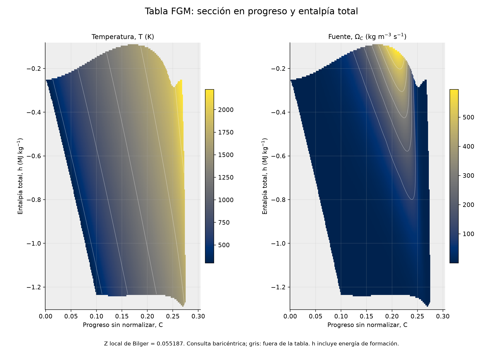

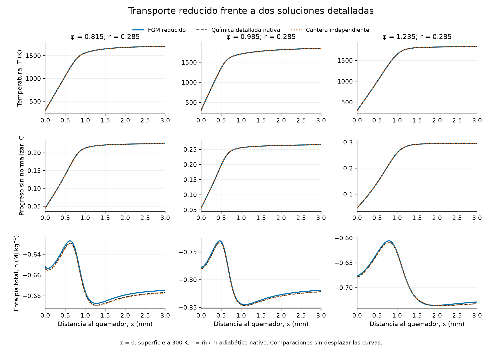

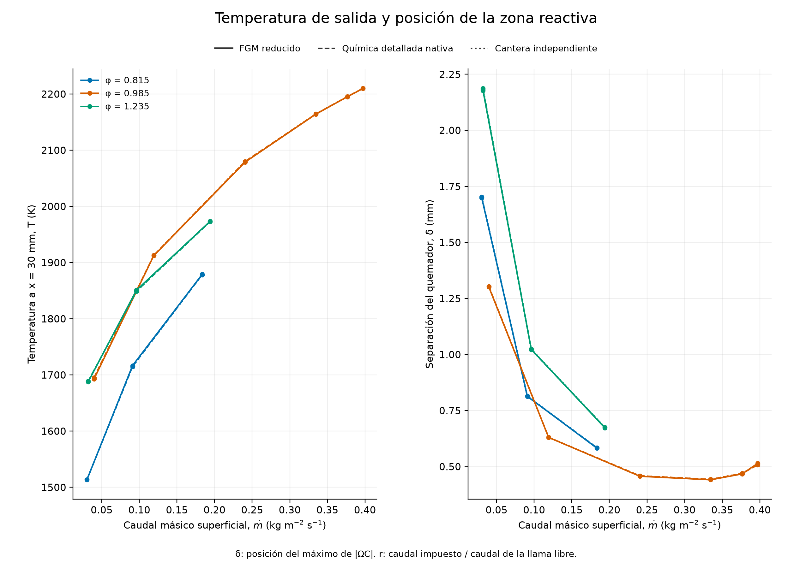

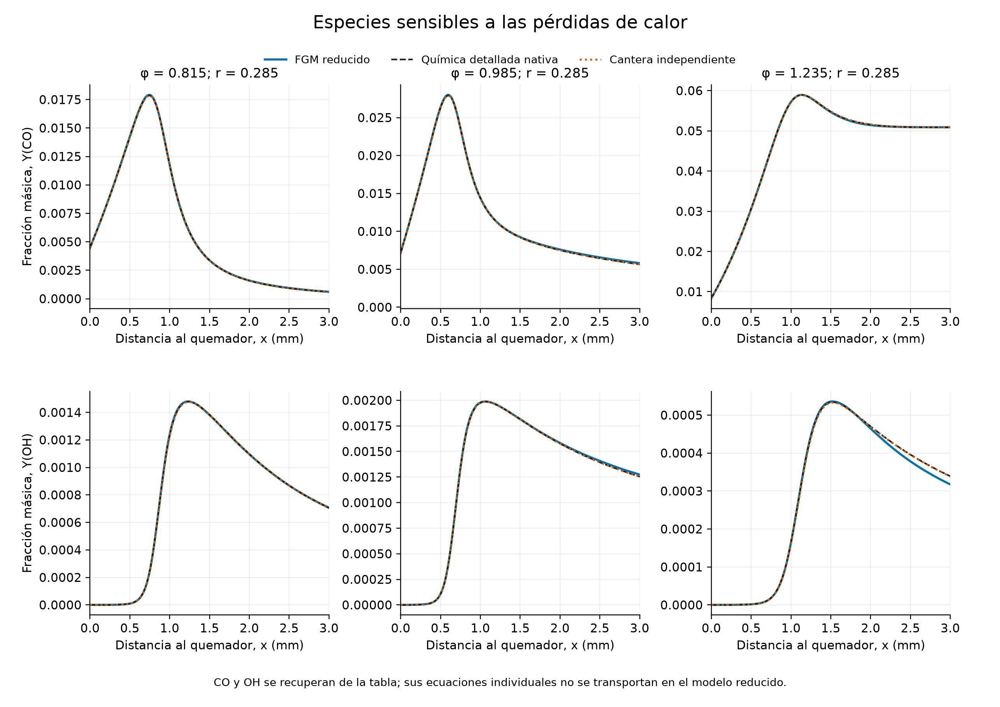

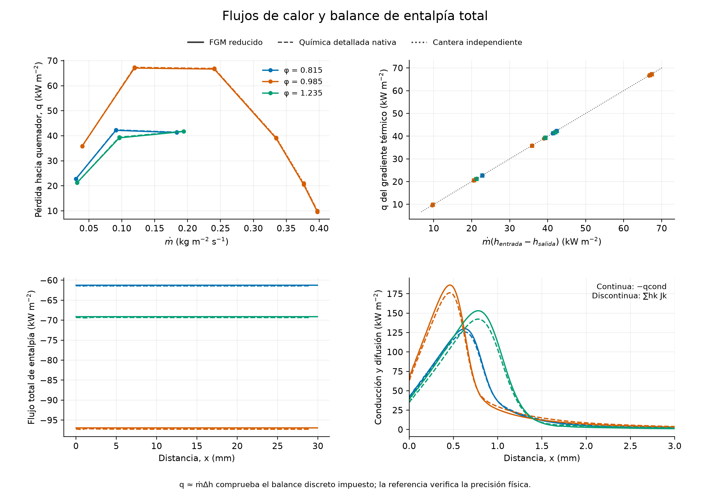

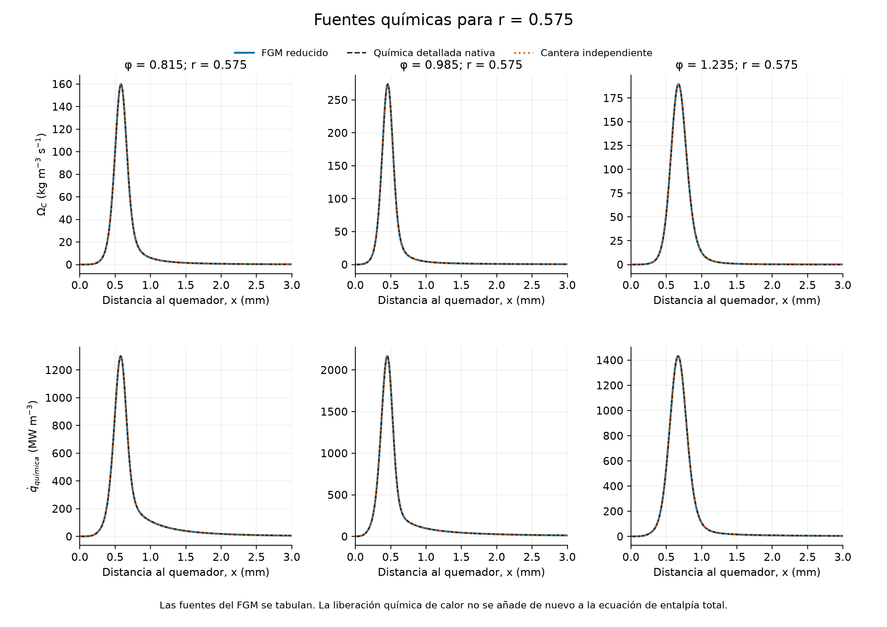

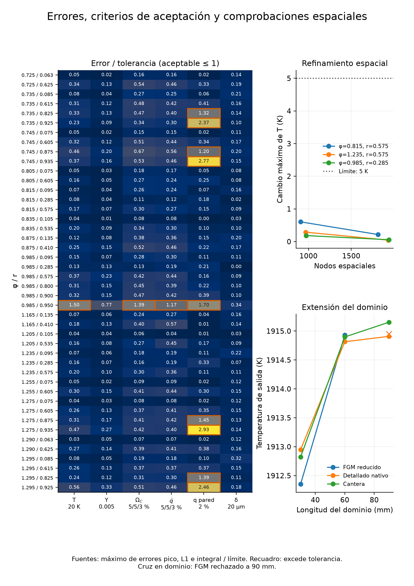

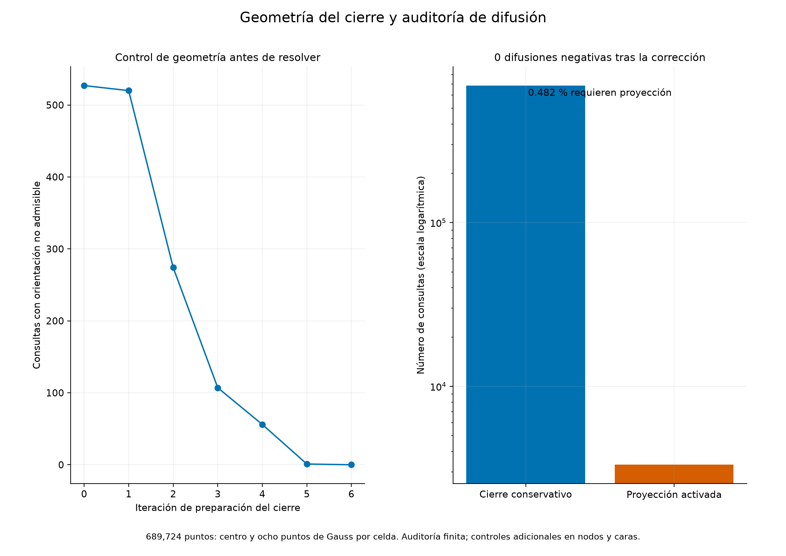

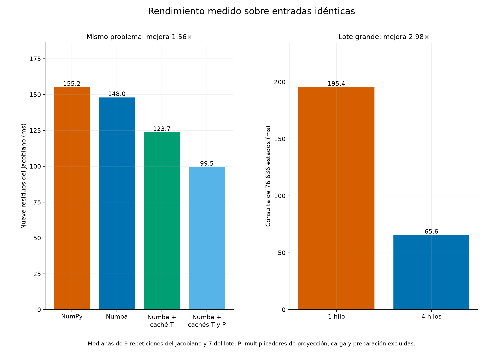

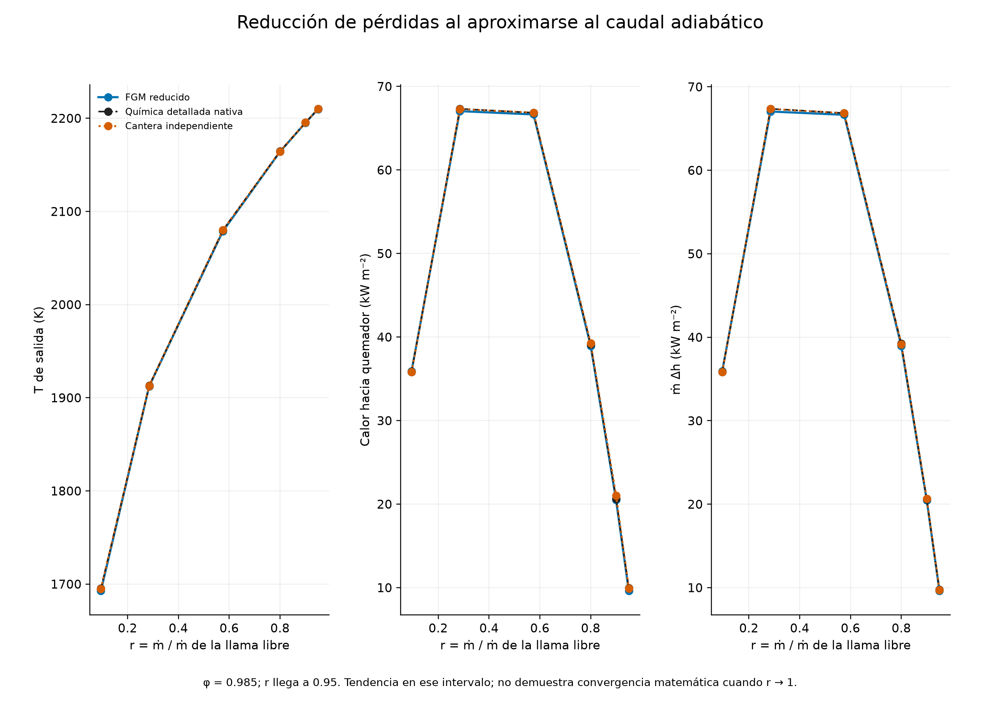

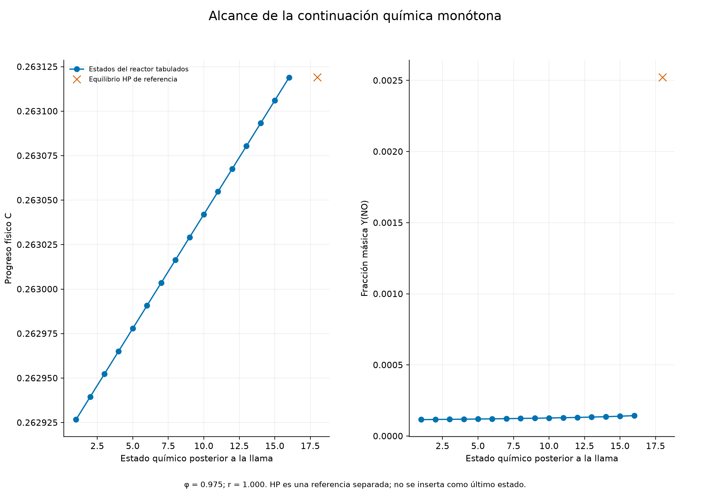

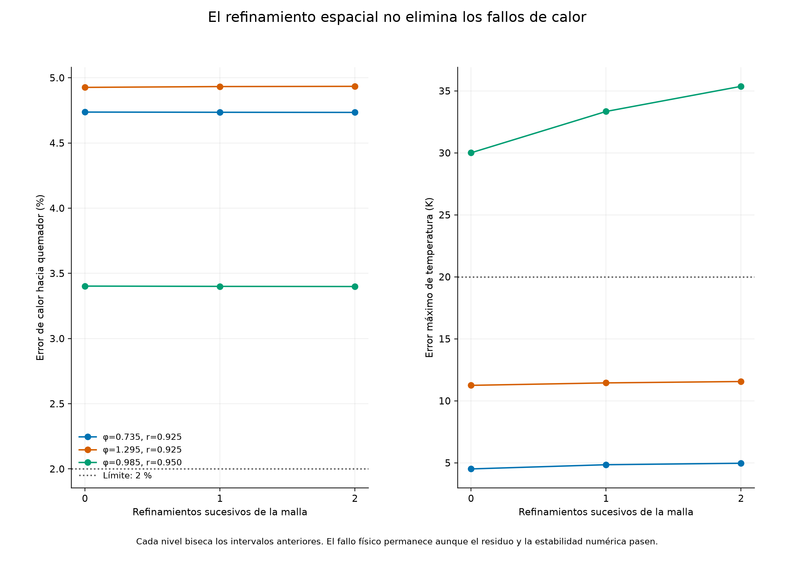
