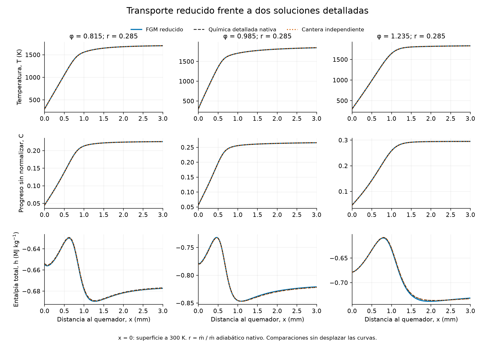
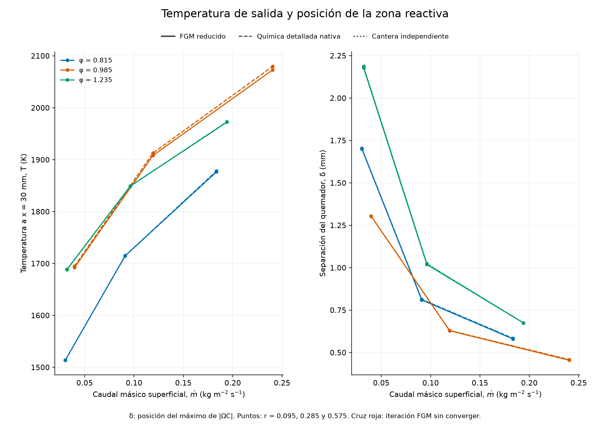
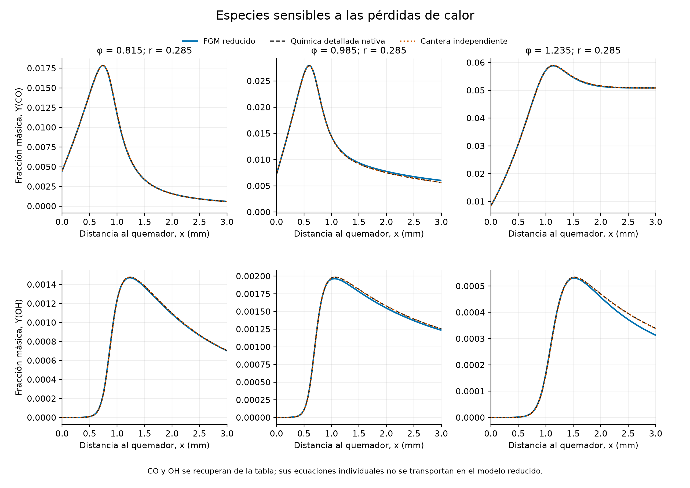
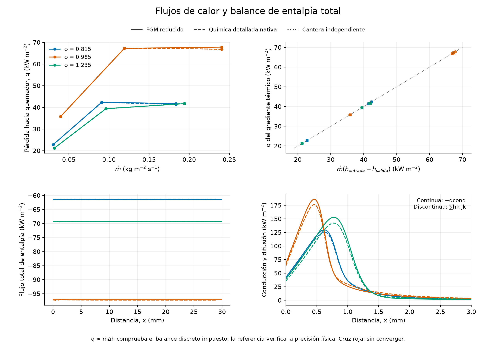
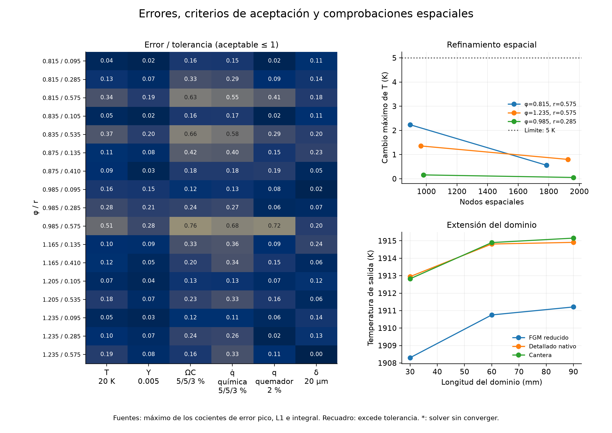

# Transporte FGM con pérdidas hacia un quemador

La rama `feature/nonadiabatic-enthalpy` incorpora un solver estacionario de
quemador plano que transporta **Z local de Bilger, progreso C sin normalizar y
entalpía total h**. Las especies y las fuentes se recuperan de una tabla congelada;
el solver reducido no evalúa química detallada. Se compara, sin desplazar los
perfiles, con el solver nativo de todas las especies y con `Cantera BurnerFlame`.

**Estado de la validación:** los tres casos pendientes se han corregido. Los
**17 casos independientes convergen y cumplen todas las tolerancias**, sin
relajar los límites: 13 casos de desarrollo y cuatro condiciones nuevas
reservadas después de seleccionar el método. El mayor error de fuente es
3.81 %, el de temperatura 10.18 K y el del calor hacia el quemador 1.43 %.
Esto certifica las comparaciones realizadas, **no todo el espacio de la tabla**:
una auditoría más amplia encuentra regiones de cierre no admisible, y el
solver rechaza las soluciones que presentan difusión negativa interior.

Se conservan las **432 llamas** de la selección publicada. Ese número corresponde
a las condiciones de CH₄-aire a 300 K y 101 325 Pa, con transporte promediado por
mezcla y sin Soret; otras condiciones requieren su propia selección y validación.
La tesis mantiene su alcance adiabático: estos cambios pertenecen a la rama del
código y a este estudio separado.

## Ecuaciones, cierre y condiciones de contorno

El flujo másico superficial impuesto es `ṁ = ρu`. Se resuelven

\[
\frac{dF_Z}{dx}=0,\qquad
\frac{dF_C}{dx}=\Omega_C,\qquad
\frac{dF_h}{dx}=0,
\]

con `F_Z = ṁZ + w_Z·J`, `F_C = ṁC + w_C·J` y
`F_h = ṁh − λ dT/dx + Σ h_k J_k` en el límite continuo. Los flujos de especies
`J_k` emplean difusión promediada por mezcla y una corrección que conserva
`ΣJ_k = 0`. La entalpía incluye formación y calor sensible: **no se añade q̇ química
como fuente a su ecuación**, pues eso contaría dos veces la energía química.
`q̇ química` se guarda únicamente como magnitud de comparación.

En el quemador se fija `T = 300 K`, se imponen los flujos alimentados de Z y C, y
se prescribe el flujo de entalpía alimentada más la pérdida conductiva estimada
en la primera cara. C en la superficie puede ser distinto del C de alimentación
por difusión de productos. A la salida se imponen gradientes nulos. El calor
hacia el quemador se define positivo y se estima como `q = λ(T₁−T₀)/(x₁−x₀)`;
es una estimación en malla finita que se debe comprobar por refinamiento.

Se utiliza una malla **no uniforme** que conserva los nodos de la llama de
entrenamiento y subdivide sus intervalos largos. Así se evita crear nodos casi
coincidentes al superponer una malla uniforme. La advección usa un ajuste por
Peclet que tiende al esquema centrado para Peclet pequeño y al upstream para
Peclet grande; la difusión preferencial y el flujo de entalpía de especies se
mantienen explícitos. No se atribuye al sistema acoplado una garantía de
positividad procedente de un esquema escalar.

Estas ecuaciones siguen la estructura de los balances reducidos y del cierre
de entalpía de [van Oijen y de Goey (2000)](https://doi.org/10.1080/00102200008935814),
que también comparan temperatura de salida, separación del quemador y perfiles
de especies. [Gövert et al. (2018)](https://link.springer.com/article/10.1007/s10494-017-9848-4)
utilizan flamelets de quemador obtenidos variando el caudal y muestran mapas de
fuente en progreso y entalpía, además de perfiles de temperatura, CO y OH.
Los mecanismos, cierres de difusión y condiciones de esos trabajos difieren
de los de este ejemplo: nuestras curvas no son una reproducción cuantitativa
de sus figuras.

## Algoritmo y datos tabulados

La suma anterior `C = YCO₂ + YCO + YH₂O + 0.5 YH₂` permitía una dirección
difusiva negativa en la zona posterior a la llama rica con mayores pérdidas.
Con ese cierre, añadir iteraciones no resolvía el problema. La biblioteca de
transporte utiliza ahora

\[
C = Y_{CO_2}+Y_{CO}+Y_{H_2O}+5Y_{H_2}.
\]

Los pesos son editables en [reduced_progress_weights.json](../examples/reduced_progress_weights.json).
El valor 5 corresponde a esta biblioteca de CH₄: **no es una constante universal**
ni una recomendación literal de un artículo. La elección y optimización del
progreso, y su efecto en el transporte, se estudian en
[Gupta, Teerling y van Oijen (2021)](https://doi.org/10.1080/13647830.2021.1926544).
La comprobación de difusión y los limitadores utilizados aquí son decisiones
de esta implementación. Cambiar C modifica el cierre reducido y requiere
validación física; no basta con cambiar las etiquetas de una figura.

La retabulación conserva exactamente Y, T, h, Z, q̇, densidad, cp y conductividad
de las 432 llamas. Recalcula C y su fuente con cinética **nativa, fuera del solver
reducido**, y reconstruye el mallado físico. Todas las filas aumentan
estrictamente en C; no hay tetraedros plegados ni degenerados.

Newton opera sobre tres coordenadas numéricas acotadas del mallado estructurado;
**no sustituyen los controles físicos ni normalizan Z o C**. El cierre predeterminado
usa B-splines cuadráticas en las tres direcciones y 27 coeficientes locales.
En composición y pérdidas se construyen coeficientes de interpolación, limitados
con un escalar común a especies, h y fuentes. Además de positividad, se impone
monotonicidad de C en todos los polígonos de control. El parámetro
`curvature_limit=0.75` limita la corrección; la coordenada de progreso conserva
una aproximación convexa. El cierre es C1, conserva la suma de especies y
recupera T invirtiendo la entalpía total. Los coeficientes se preparan una vez y
se reutilizan al resolver otros caudales.

Es una **aproximación limitada**, que no interpola exactamente todos los vértices.
Las [propiedades de B-splines](https://docs.scipy.org/doc/scipy/reference/generated/scipy.interpolate.BSpline.html)
justifican el soporte compacto, no la validez física del cierre. Esta se evalúa
a posteriori. `NonAdiabaticFGM.lookup_batch` y `interpolation='barycentric'`
conservan la consulta original entre tetraedros; el mapa C-h representa esa
consulta física, con Z local de Bilger fijo.

La inicialización resuelve primero un cierre reducido de menor orden. Una
**continuación adaptativa** aumenta la contribución del cierre final; reduce
el incremento si Newton falla y solo avanza tras converger. La solución
aceptada siempre satisface las ecuaciones del cierre final, con parámetro 1.
El presupuesto de iteraciones incluye guía, pasos aceptados y pasos fallidos.
No se usan campos de las referencias independientes para iniciar el FGM.

El Jacobiano disperso tiene tres bloques por fila y **nueve colores**. La caché
reutiliza las temperaturas de nodos que no cambian. Newton mantiene las
coordenadas dentro del dominio; una regularización dispersa ayuda cuando falla
la búsqueda del paso. Se notifican singularidad, estancamiento, agotamiento del
presupuesto o fallo de continuación. Una comprobación adicional obtiene las
derivadas analíticas de las B-splines y de h(T,Y), y rechaza difusión reducida
con autovalores de parte real negativa en nodos interiores. Los extremos tienen
condiciones algebraicas, por lo que no se les aplica ese criterio diferencial.

Los 181 estados físicos originales y los 16 estados de continuación química
por llama permanecen: **197 estados por llama y 85 104 vértices**. La continuación
es un reactor homogéneo adiabático de presión constante hacia equilibrio HP,
con BDF nativo (`rtol=1e-9`, `atol_Y=1e-15`, `atol_T=1e-8 K`). Su selección
original utilizaba los pesos de C anteriores; esa procedencia se conserva en
los metadatos. La masa de redondeo corregida es como máximo 1.25×10⁻¹⁷ y el
error elemental 6.67×10⁻¹⁴. La máxima diferencia de especie antes del extremo HP
es 0.00274. Este cierre posterior no equivale a nuevas llamas espaciales ni
valida apagado transitorio frente a una pared.

## Resultados y criterios de aceptación

Las semillas son perfiles de entrenamiento con SHA-256 verificada. Se congelan
tabla, código, condiciones y tolerancias antes de las comprobaciones. Los cuatro
casos anteriormente reservados forman ahora parte de los 13 casos de desarrollo;
los nuevos casos de confirmación son `φ = 0.835, 1.205` y `r = 0.535, 0.105`.
Sus cuatro combinaciones se ejecutaron después de fijar el método y pasan.

| Magnitud | Límite | Mayor error entre los 17 casos |
|---|---:|---:|
| Temperatura, máximo absoluto | 20 K | 10.18 K |
| Fracción másica, máximo absoluto entre todas las especies | 0.005 | 0.00140 |
| Fuente / pico de referencia | 5 % | ΩC: 3.00 %; q̇: 2.75 % |
| Fuente, L1 | 5 % | ΩC: 3.81 %; q̇: 3.41 % |
| Fuente, integral | 3 % | ΩC: 0.386 %; q̇: 0.665 % |
| Calor hacia el quemador | 2 % | 1.43 % |
| Separación δ | 20 µm | 4.83 µm |

El error L1 es `∫|predicción−referencia|dx / ∫|referencia|dx`; el error integral
usa `|∫(predicción−referencia)dx|` con el mismo denominador. El error dividido por
el pico no es un error relativo local en puntos de fuente casi nula. δ se define
por el máximo de `|ΩC|`, con interpolación cuadrática de tres nodos, idénticamente
en los tres modelos. Al cambiar los pesos de C también cambia la magnitud ΩC y
esta definición de δ; **no se comparan sus valores absolutos entre versiones**.

La comparación anterior y posterior utiliza q̇, calor y T, que conservan su
significado físico:

| Caso antes pendiente, φ / r | Antes | Ahora |
|---|---|---|
| 0.815 / 0.575 | Calor 2.27 %; L1 de q̇ 5.22 % | Calor 0.824 %; L1 de q̇ 2.75 %; aceptado |
| 1.235 / 0.575 | L1 de q̇ 5.47 % | L1 de q̇ 1.67 %; aceptado |
| 1.235 / 0.095 | Residuo estancado | Residuo ≤1e-7; T 1.04 K; calor 0.112 %; aceptado |

La referencia detallada nativa y Cantera difieren como máximo 3.64 K y 0.176 %
en calor. Los seis refinamientos de malla pasan: el mayor cambio final de T
es 0.799 K y el del calor 0.00128 %. Para `φ=0.985, r=0.285`, ampliar de 60 a
90 mm cambia T de salida 0.457 K en FGM, 0.093 K en el nativo y 0.255 K en
Cantera. Son comprobaciones de esas condiciones, no pruebas globales.

La auditoría de todos los **76 636 centros de celda** detecta **486** estados
con difusión reducida no admisible. Se publican en `parabolicity_audit.json`:
la biblioteca completa **no queda certificada**. Los 17 perfiles aceptados no
presentan esa anomalía en su interior. El control evita aceptar una solución
inadecuada en una condición nueva, pero no garantiza que toda condición tenga
un cierre válido. Certificar toda la biblioteca necesitaría revisar esas
regiones, la definición de progreso o la dimensión del manifold. Incluso un
muestreo sin fallos no demostraría positividad en todos los puntos de cada celda.

Las **72 pruebas automáticas** comprueban, entre otras propiedades, conservación,
consistencia termodinámica, derivadas continuas, monotonicidad de todos los
polígonos de progreso y recuperación de difusión positiva cuando Le=1.

Los 13 casos de desarrollo tardan **1.33–2.42 s**, con mediana **1.58 s**, incluida
la preparación, la guía y la continuación. Cargar la tabla cuesta unos 2.52 s,
una vez por modelo. La caché reduce el cálculo mediano de nueve perturbaciones
del Jacobiano de 85.2 a 57.2 ms, **1.49×**, sin diferencias en los residuos.
La mejora de robustez añade trabajo respecto al solver anterior; estos tiempos
son de una máquina concreta y excluyen la construcción y las referencias
detalladas. El FGM de producción sigue sin evaluar cinética detallada.

## Figuras y reproducción

Las curvas no se desplazan para mejorar el acuerdo. La cruz identifica la
iteración sin converger; los recuadros muestran tolerancias excedidas. Se utiliza
Cividis en campos escalares y líneas diferenciadas; no existe un único color
obligatorio para presentar un FGM. El gris identifica consultas fuera de la tabla.

Para redibujar las siete figuras y el PDF a partir de los arrays publicados:

~~~sh
python -m examples.plot_reduced_burner --output output/figures/reduced-burner --pdf output/pdf/Validacion_FGM_perdidas.pdf
~~~

Para reconstruir la selección, la continuación y la nueva definición de C:

~~~sh
python -m examples.reconstruct_adaptive_table --output runs/fgm432
python -m examples.extend_reduced_fgm_tail --source runs/fgm432 --output runs/fgm432_extended --reactor-cache docs/assets/reduced-burner/reactor_tail.npz
python -m examples.retabulate_reduced_progress --source runs/fgm432_extended --output runs/fgm432_robust
python -m examples.example_reduced_burner --table runs/fgm432_robust --output runs/reduced_example
~~~

La ruta reproduce la tabla empleada en el entorno probado, SHA-256
`0d22d338d47f9a34dd5397f5a5f6e904002ccfa59f6661cdddf63e72759d63e8`.
No se vuelven a simular llamas; la fuente del nuevo C se calcula fuera del solver
de transporte. Omitir `--reactor-cache` repite los reactores nativos, no añade
flamelets. Se publican las semillas de entrenamiento y todos los planes.

Para repetir desarrollo, confirmación y comprobaciones espaciales:

~~~sh
python -m examples.validate_reduced_burner --table runs/fgm432_robust --profiles docs/assets/reduced-burner/seeds --output runs/reduced_validation --settings examples/reduced_burner_development_settings.json
python -m examples.validate_reduced_burner --table runs/fgm432_robust --profiles docs/assets/reduced-burner/seeds --output runs/reduced_confirmation --settings examples/reduced_burner_confirmation_settings.json
python -m examples.check_reduced_burner_convergence --table runs/fgm432_robust --validation runs/reduced_validation --profiles docs/assets/reduced-burner/seeds
python -m examples.audit_reduced_diffusion --table runs/fgm432_robust --output runs/parabolicity_audit.json
python -m examples.benchmark_reduced_burner --table runs/fgm432_robust --case runs/reduced_validation/case_0.985000_0.285000 --output runs/reduced_benchmark.json
~~~

La validación detallada requiere el extra `[reference]`; el solver reducido y
la construcción nativa no requieren Cantera. Cambiar tolerancias o condiciones
requiere una carpeta nueva: el ejemplo rechaza cachés con otro plan, tabla,
mecanismo, parámetros físicos o código del solver reducido.

La certificación fuera de los casos ensayados y el apagado de pared requieren
trabajo adicional. [Efimov et al. (2020)](https://doi.org/10.1080/13647830.2019.1658901)
estudian controles adicionales para representar la historia térmica y CO en
interacción llama-pared; su QFM y geometría difieren de este quemador plano.
No se validan radiación, conducción dentro del sólido, pared multidimensional,
apagado transitorio ni un FGM no adiabático de H₂. La tesis conserva su alcance
adiabático.
