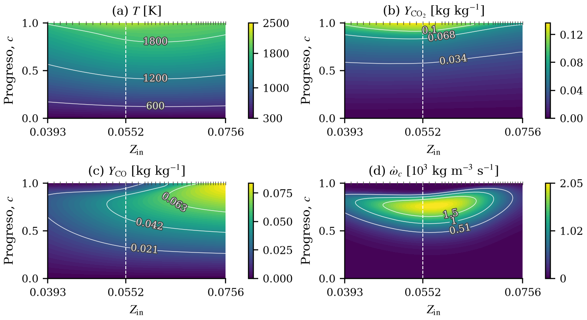
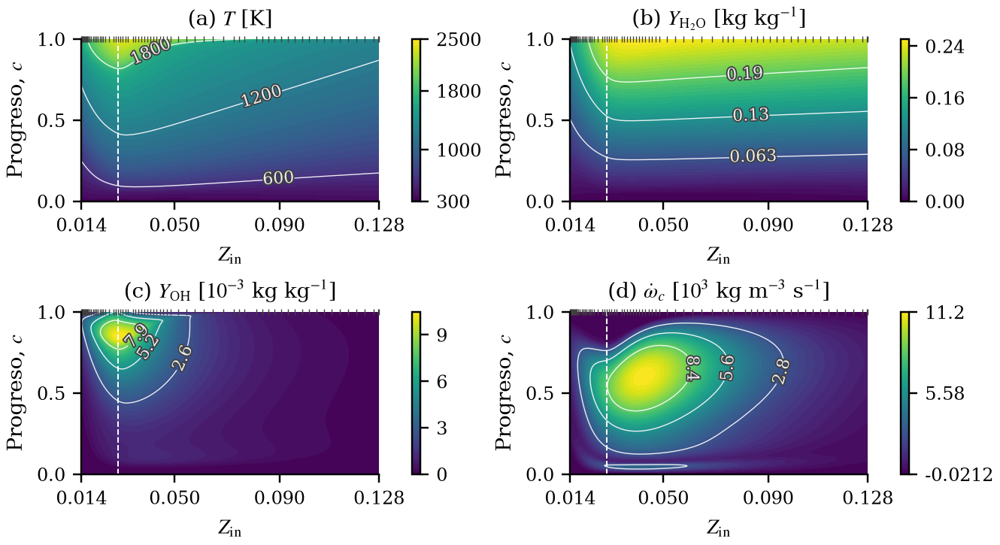
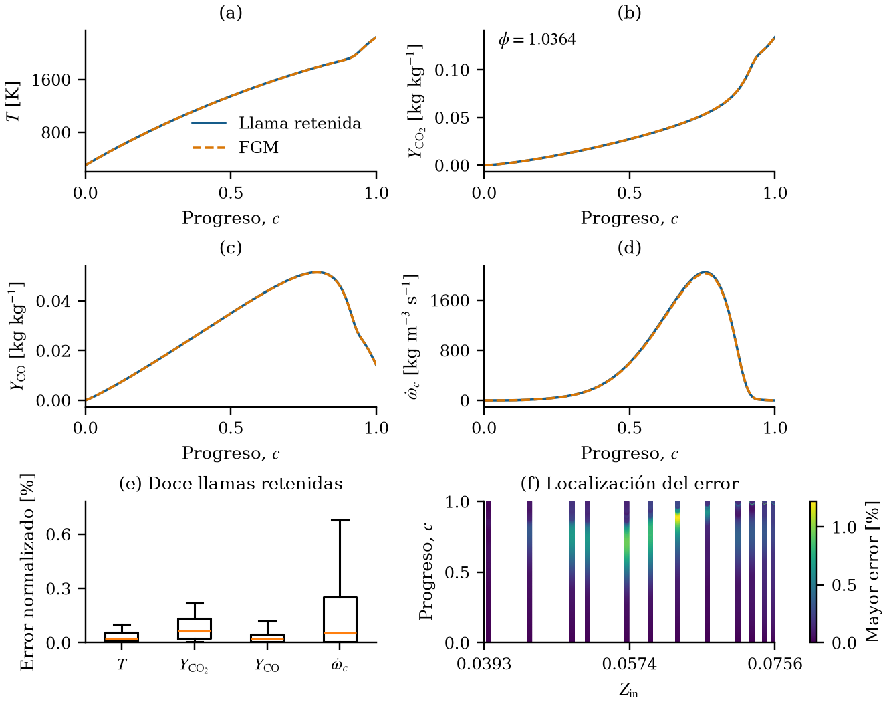
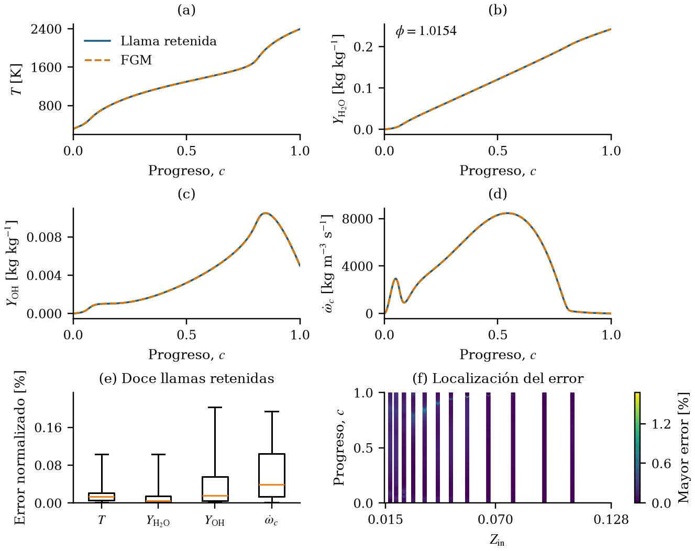
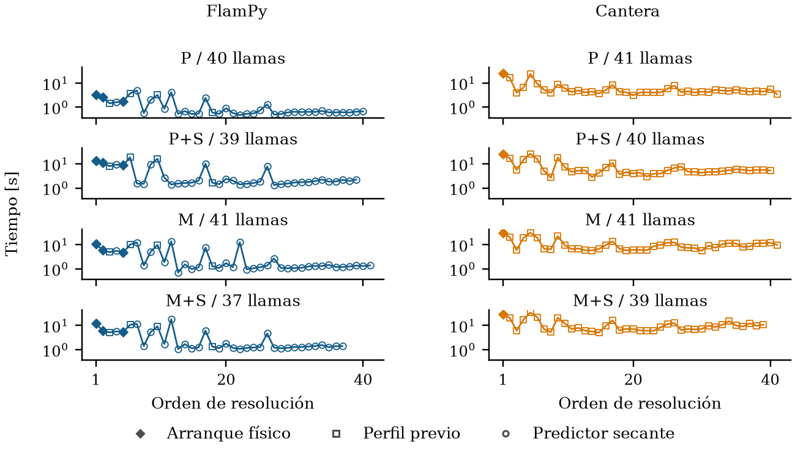
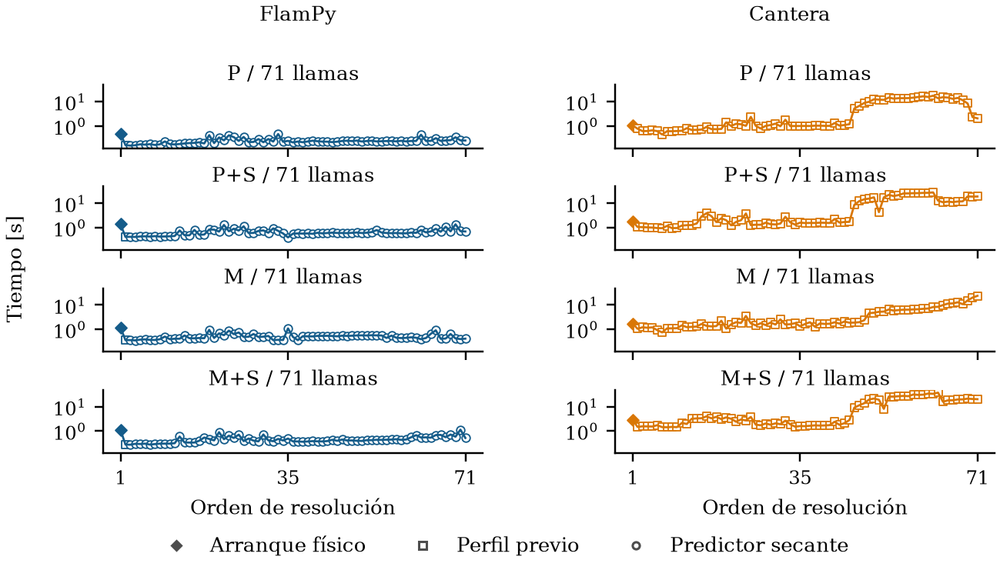

# Resultados ilustrados

[Inicio](../README.md) · [API](api.md) · [Archivos y consulta](outputs.md)

La galería muestra campos de ejecuciones numéricas guardadas del núcleo
de FlamPy. Los datos de las figuras se incluyen en el repositorio para
reproducirlas sin volver a resolver las llamas.

## Llama de metano–aire

| Condición o resultado | Valor |
|---|---|
| Mecanismo | `gri30.yaml`, 53 especies |
| Combustible / oxidante | CH₄ / aire, O₂:N₂ = 1:3,76 en base molar |
| Relación de equivalencia | φ = 1 |
| Temperatura de entrada | 300 K |
| Presión | 101 325 Pa |
| Transporte | Promediado por mezcla, sin Soret |
| Velocidad laminar Sᵤ | 0,378831 m/s |
| Nodos finales | 261 |
| Aceptación numérica registrada | Sí |

Se dibujan los nodos originales. La posición se desplaza al punto medio
del salto de temperatura y la ventana se concentra en el frente de llama;
el archivo conserva el dominio completo. La velocidad local aumenta con
la expansión del gas. La velocidad de propagación Sᵤ corresponde a la
mezcla no quemada y se distingue de esa velocidad local.

## Tablas FGM de metano e hidrógeno

Ambas familias corresponden a entrada a 300 K, presión de 101 325 Pa,
transporte promediado por mezcla sin Soret. Sus intervalos de composición
son diferentes y se indican en la tabla.

| Resultado de estas construcciones | CH₄–aire | H₂–aire |
|---|---|---|
| Mecanismo | `gri30.yaml` | `h2o2.yaml` |
| Intervalo de φ | 0,7–1,4 | 0,5–5 |
| Bilger de entrada Zᵢₙ | 0,03928–0,07559 | 0,01447–0,12801 |
| Flamelets del mapa | 40 | 71 |
| Puntos de progreso | 241 | 1001 |
| Todas las llamas finales aceptadas | Sí | Sí |
| Defecto por exclusión en la tabla ilustrada | 0,903 % | 1,098 % |
| Progreso sin normalizar | Y_CO₂ + Y_H₂O + Y_CO + 0,5 Y_H₂ | Y_H₂O + 10 Y_HO₂ − Y_OH |

Las dos imágenes usan la misma escala de color para temperatura. El eje
horizontal es el Bilger de entrada Zᵢₙ, referido a corrientes molares,
sin reescalar su intervalo. El eje vertical es el progreso normalizado c.
Las marcas superiores indican mezclas resueltas y la línea discontinua
indica estequiometría. Las fracciones másicas y la fuente tienen barras
propias con unidades; el mínimo negativo de la fuente en H₂ se conserva.

El número final de flamelets es propio de cada construcción y no un
resultado garantizado para cualquier configuración o versión. El defecto
por exclusión mide consistencia de interpolación entre filas; no es una
medida de error frente a experimentos ni una cota global del error físico.
CH₄ se refinó hacia un objetivo del 1 %. En H₂ se resolvieron las mismas
71 composiciones con ambos solvers y los cuatro transportes; sus defectos
medidos abarcan 1,065–1,107 %, sin imponer el objetivo del 1 %.

## Fidelidad de interpolación

La prueba de CH₄ utiliza una tabla independiente de **44 flamelets**;
la de H₂ utiliza la misma tabla de **71** del mapa. Cada prueba compara
doce llamas ajenas a la construcción, en 1001 posiciones uniformes de c.
Los paneles (a–d) muestran la llama más próxima a φ = 1 en log φ.
Las cajas muestran mediana, cuartiles y bigotes P5–P95; el mapa de error
incluye todas las muestras y su barra alcanza el máximo observado.

Para cada campo, el error es 100 |FGM − llama| / escala. La escala de
temperatura es el mayor salto térmico entre las llamas retenidas; para las
otras magnitudes es el máximo módulo del campo en ese conjunto.
Esto evita dividir por valores locales casi nulos y distingue estos errores
normalizados de los errores relativos locales de especies minoritarias.

| Error máximo normalizado [%] | CH₄ | H₂ |
|---|---:|---:|
| Temperatura | 0,423 | 1,670 |
| CO₂ / H₂O | 1,048 | 0,153 |
| CO / OH | 0,821 | 0,779 |
| Fuente de progreso | 1,219 | 0,765 |

## Tiempo por flamelet

P indica transporte promediado, M multicomponente y S Soret. Cada panel
corresponde a una construcción, con tiempos registrados que incluyen
propiedades y excluyen el calentamiento previo. El eje temporal es
logarítmico. Los símbolos distinguen arranque físico, copia del perfil previo
y predictor secante; no expresan una tasa de éxito.

Los tiempos se registraron en CPU AMD Ryzen 9 7845HX, con Python 3.11,
NumPy 2.4.6, SciPy 1.17.1, Numba 0.65.1 y Cantera 3.2.0;
cuatro hilos Numba y uno para BLAS/OpenMP, con casos secuenciales.

H₂ se resuelve en orden creciente de φ: FlamPy utiliza un arranque,
una copia y 69 predictores secantes por familia; Cantera utiliza un
arranque y 70 perfiles previos. CH₄ comienza con cinco composiciones y
después incorpora las solicitadas por refinamiento, por lo que su orden
de resolución no es un barrido monótono de φ.

## Reproducir las imágenes

Desde la raíz del repositorio:

~~~sh
python -m pip install -e ".[plots]"
python docs/assets/generate_fgm_figures.py
~~~

[`generate_fgm_figures.py`](assets/generate_fgm_figures.py) es el código
utilizado para generar estas seis figuras y sus equivalentes en la memoria.
Escribe PNG y PDF con NumPy y Matplotlib y comprueba los SHA-256 de las
entradas. Para regenerar también la llama individual:
`python docs/assets/generate_gallery.py`.

Los archivos compactos de [assets/data/](assets/data/) contienen solo los
campos necesarios para dibujar. La [procedencia](assets/data/provenance.json)
registra condiciones, identificadores de origen y SHA-256 de cada archivo
publicado, junto con los hashes de sus fuentes y las versiones de NumPy
y Matplotlib. No necesita rutas privadas ni nuevas simulaciones.
Los tiempos reproducidos son los registrados, no nuevas mediciones.

Estos archivos ilustrativos no son tablas completas para consulta de
composición o exportación. Para generar resultados completos utiliza los
[ejemplos](../examples/README.md) y consulta su [estructura](outputs.md).
